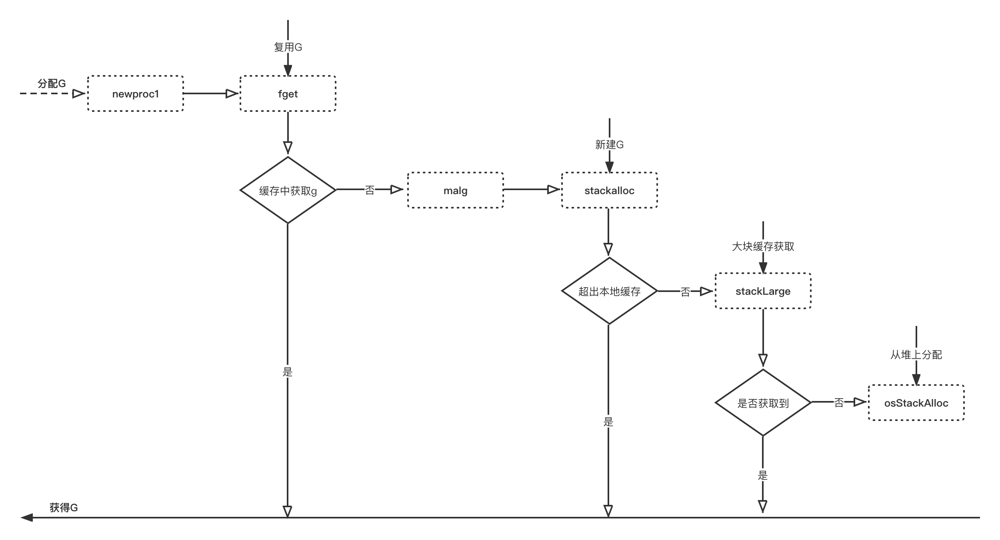

# 分配

## 分配流程



&nbsp;

## 具体实现

新建 `G` 时，其初始栈大小为2 KB。

```go
// stack.go

_StackMin = 2048
```

&nbsp;

```go
// proc.go

func newproc1(fn *funcval, callergp *g, callerpc uintptr) *g {
    // 复用 G
    newg := gfget(_p_)
    if newg == nil {
        // 没有找到可复用G，则新建G
        newg = malg(_StackMin)
    }
}
```

&nbsp;

```go
// proc.go

// Allocate a new g, with a stack big enough for stacksize bytes.
func malg(stacksize int32) *g { 
    newg := new(g)
    
    if stacksize >= 0 {
        stacksize = round2(_StackSystem + stacksize)
        systemstack(func() {
            newg.stack = stackalloc(uint32(stacksize))
        })

        newg.stackguard0 = newg.stack.lo + _StackGuard
        newg.stackguard1 = ^uintptr(0)

        // Clear the bottom word of the stack. We record g
        // there on gsignal stack during VDSO on ARM and ARM64.
        *(*uintptr)(unsafe.Pointer(newg.stack.lo)) = 0
    }
    
    return newg
}
```

&nbsp;

```go
// proc.go

// Get from gfree list.
func gfget(_p_ *p) *g {
    
    gp := _p_.gFree.pop()
    if gp == nil {
        return nil
    }
    
    if gp.stack.lo == 0 {
        // Stack was deallocated in gfput. Allocate a new one.
        systemstack(func() {
            gp.stack = stackalloc(_FixedStack)
        })

        gp.stackguard0 = gp.stack.lo + _StackGuard
    }
    
    return gp
}
```

分配操作优先从本地缓存提取。如果超出限制，则直接找全局大块缓存。

&nbsp;

```go
// mcache.go

type mcache struct {
    stackcache [_NumStackOrders]stackfreelist
}

type stackfreelist struct {
    list gclinkptr // linked list of free stacks
    size uintptr   // total size of stacks in list
}
```

&nbsp;

```go
// stack.go

// Global pool of large stack spans.
var stackLarge struct {
    lock mutex
    free [heapAddrBits - pageShift]mSpanList // free lists by log_2(s.npages)
}
```

如果缓存都不足满足需求，则从堆上分配。

&nbsp;

```go
// malloc.go

// Per-P, per order stack segment cache size.
_StackCacheSize = 32 * 1024
```

```go
// stack.go

// stackalloc allocates an n byte stack.
func stackalloc(n uint32) stack {

    // Small stacks are allocated with a fixed-size free-list allocator.
    // If we need a stack of a bigger size, we fall back on allocating
    // a dedicated span.
    
    var v unsafe.Pointer
    
    // 没有超出本地缓存限制。
    if n < _FixedStack<<_NumStackOrders && n < _StackCacheSize {

        // 计算等级。
        order := uint8(0)
        n2 := n
        for n2 > _FixedStack {
            order++
            n2 >>= 1
        }

        var x gclinkptr
        if stackNoCache != 0 || thisg.m.p == 0 || thisg.m.preemptoff != "" {

            // 全局 pool 分配。
            lock(&stackpool[order].item.mu)
            x = stackpoolalloc(order)
            unlock(&stackpool[order].item.mu)
        } else {

            // 本地 cache，对应等级链表提取。
            c := thisg.m.p.ptr().mcache
            x = c.stackcache[order].list

            // 扩容后重试。
            if x.ptr() == nil {
                stackcacherefill(c, order)
                x = c.stackcache[order].list
            }

            c.stackcache[order].list = x.ptr().next
            c.stackcache[order].size -= uintptr(n)
        }

        v = unsafe.Pointer(x)

    } else {
        
        // 大块。 
        var s *mspan
        npage := uintptr(n) >> _PageShift
        log2npage := stacklog2(npage)
    
        // 从大块缓存获取。
        lock(&stackLarge.lock)
        if !stackLarge.free[log2npage].isEmpty() {
            s = stackLarge.free[log2npage].first
            stackLarge.free[log2npage].remove(s)
        }
        unlock(&stackLarge.lock)
    
        // 如果没有大块缓存，则从堆分配。
        if s == nil {
            s = mheap_.allocManual(npage, spanAllocStack)
            osStackAlloc(s)
            s.elemsize = uintptr(n)
        }

        v = unsafe.Pointer(s.base())
    }

    // stack { lo, hi }
    return stack{uintptr(v), uintptr(v) + uintptr(n)}
}
```
