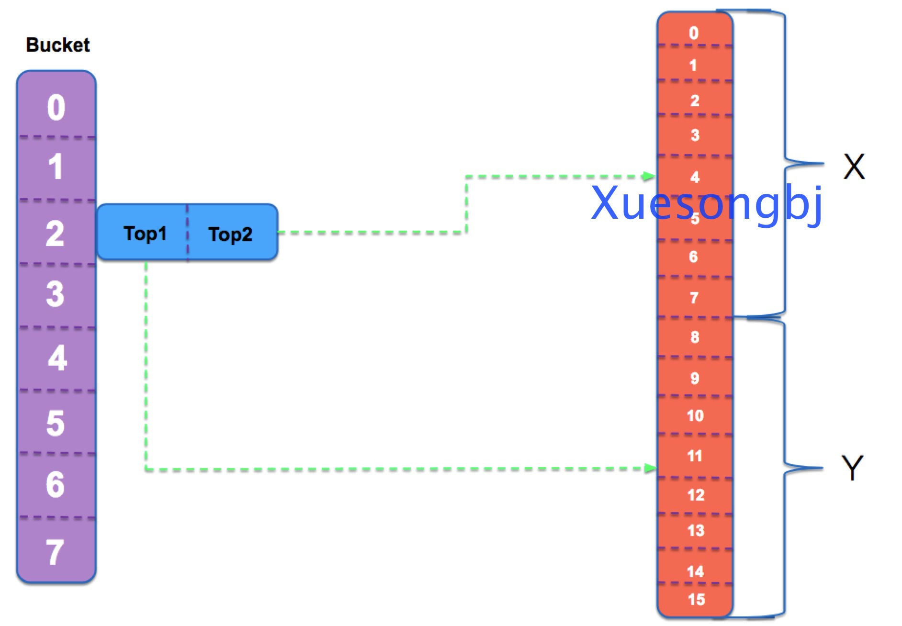
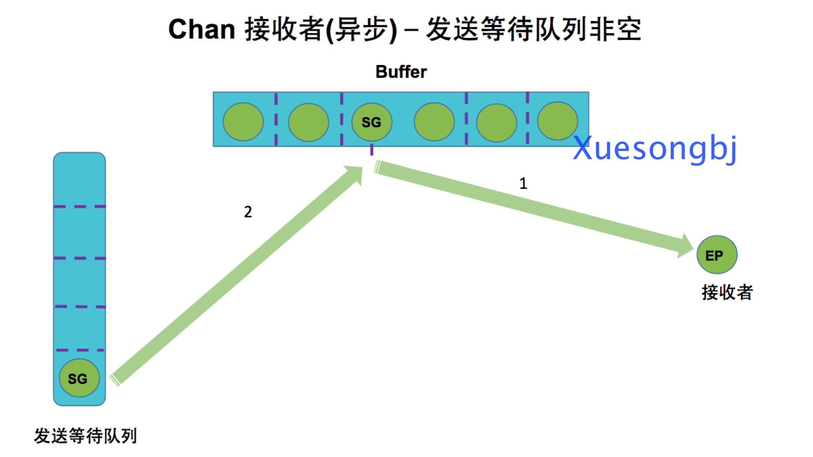

# chan
通道用途在于传递”消息”。


## chan 功能

* Go并未在语言层面实现严格并发安全。
* Go鼓励CSP模型。以通信代替内存共享,实现并发安全。
* channel是显式的,需操作双方实现约定数据类型和持有通道饮用。
* channel不关心另一身份和人数。如对方未准备妥当,可能引发阻塞。
* channel所发送消息,除数据外,还可是”事件”。


## chan 实现

### hchan 结构体

```
type hchan struct {
 qcount   uint           // 队列长度(已经占用槽位数)
 dataqsiz uint           // 环状队列大小(buffer总槽位数)
 buf      unsafe.Pointer // points to an array of dataqsiz elements (存放数据的buffer)
 elemsize uint16         // 存放的数据类型大小
 closed   uint32         // chan是否已经被关闭
 elemtype *_type         // 元素类型(chan存放的数据类型)
 sendx    uint           // 发送数据时buf索引
 recvx    uint           // 接收数据时buf索引
 recvq    waitq          // 接收等待(阻塞)队列
 sendq    waitq          // 发送等待(阻塞)队列
}
```


### waitq 结构体
```
type waitq struct {
 first *sudog         // sudog header
 last  *sudog         // sudog tail
}
```

### sudog 结构体
sudog代表在等待队列中的g。g和synchronization object是多对多关系(g每次执行的共享对象数据不同),所以一个g可能有多个sudog。

sudog使用acquireSudog和releaseSudog从特殊的Pool获取和释放的。

```
type sudog struct {
     // The following fields are protected by the hchan.lock of the
     g *g

     // isSelect indicates g is participating in a select, so
     // g.selectDone must be CAS'd to win the wake-up race.
     isSelect bool
     next     *sudog
     prev     *sudog
     elem     unsafe.Pointer  // 数据(可能被分配在stack上)

     // The following fields are never accessed concurrently.
     // For channels, waitlink is only accessed by g.
     // For semaphores, all fields (including the ones above)
     // are only accessed when holding a semaRoot lock.

     acquiretime int64
     releasetime int64
     ticket      uint32
     parent      *sudog // semaRoot binary tree
     waitlink    *sudog // g.waiting list or semaRoot
     waittail    *sudog // semaRoot
     c           *hchan // channel
}
```

## 创建&初始化chan


### 实现

```
func makechan(t *chantype, size int) *hchan {
     elem := t.elem

     // Hchan does not contain pointers interesting for GC when elements stored in buf do not contain pointers.
     // buf points into the same allocation, elemtype is persistent.
     // SudoG's are referenced from their owning thread so they can't be collected.
     // TODO(dvyukov,rlh): Rethink when collector can move allocated objects.
     var c *hchan
     switch {
     case size == 0 || elem.size == 0:
         // Queue or element size is zero.
         // 1. make(chan int), Queue is zero.
         // 2. make(chan struct{}, 2), element is zero,but Queue is not zero.
         // 3. make(chan struct{}), Queue and element size is zero.
         c = (*hchan)(mallocgc(hchanSize, nil, true))
         // Race detector uses this location for synchronization.
         c.buf = c.raceaddr()
     case elem.kind&kindNoPointers != 0:
         // Channel元素不包含指针类型
         // hchan 和 hchan.buf 分配内存
         // hchan 和 hchan.buf 内存相临
         c = (*hchan)(mallocgc(hchanSize+uintptr(size)*elem.size, nil, true))
         c.buf = add(unsafe.Pointer(c), hchanSize)
     default:
         // Channel元素包含指针
         // hchan 和 hchan.buf
         // hchan 和 hchan.buf 分配内存
         c = new(hchan)
         c.buf = mallocgc(uintptr(size)*elem.size, elem, true)
     }

     c.elemsize = uint16(elem.size) // 元素大小(make(chan int),  c.elemsize == 8byte)
     c.elemtype = elem              // 元素类型(make(chan int),  c.elemtype == int)
     c.dataqsiz = uint(size)        // 环状队列大小(make(chan int, 2), c.dataqsiz == 2)

     return c
}
```

### 发送数据

#### 示例代码
```
c := make(chan int)        // 同步队列
c<-1

c := make(chan int, 1)     // 异步队列
c<-1
```


##### 发送数据实现


```
func chansend(c *hchan, ep unsafe.Pointer, block bool, callerpc uintptr) bool {
     // block 表示是否阻塞模式

     // 通道没有关闭,但通道发送未就绪
     // 不能进行发送
     if !block && c.closed == 0 && ((c.dataqsiz == 0 && c.recvq.first == nil) ||
         (c.dataqsiz > 0 && c.qcount == c.dataqsiz)) {
         return false
     }

     // 发送之前先获取锁
     lock(&c.lock)

     // 不能向已关闭channel发送数据
     if c.closed != 0 {
         unlock(&c.lock)
         panic(plainError("send on closed channel"))
     }

     // 等待队列出现等待者有两种情况:
     // 1. 异步队列: Buffer为空,等待队列出现等待者.
     // 2. 同步队列: 等待者等待接收者给它数据.
     if sg := c.recvq.dequeue(); sg != nil {
         // 如果接收等待队列有等待者,直接将数据发送给等待者。直接发送给等待者
         send(c, sg, ep, func() { unlock(&c.lock) }, 3)
         return true
     }

     // buffer 槽位没有满
     // 异步队列
     if c.qcount < c.dataqsiz {
         // Space is available in the channel buffer. Enqueue the element to send.
         qp := chanbuf(c, c.sendx) // 拿到数据发送到buffer的位置

         // 将数据拷贝到buffer中下标为c.sendx位置
         typedmemmove(c.elemtype, qp, ep)

         // 发送索引加1
         c.sendx++

         // 环形队列,如果达到了队列最大值,归0
         if c.sendx == c.dataqsiz {
             c.sendx = 0
         }

         // 队列计数器(已占)
         c.qcount++
         unlock(&c.lock)
         return true
     }

     // 异步队列: buffer队列满了(数据没有及时被消费)
     // 同步队列: 没有接收等待者,此时产生的数据。将数据发送到等待队列(阻塞,等待消费者)
     // 需要创建等待sudog,sudog和g进行绑定,然后放入发送等待队列.

     // 获取当前goroutine
     gp := getg()

     // 新创建一个sudog
     // 1. 创建sudog时,从sudogcache中获取,提升性能.
     // 2. sudogcache空间为空,通过malloc创建内存空间,然后将该空间放到sudogcache中.
     //
     // 注意:
     // 1. 通过acquireSudog创建sudog,在创建sudog时会触发malloc,因此会调用GC(触发STW).
     // 2. Go 通过在acquirem/releasem增加m.locks,使得gc不被触发.
     // TODO:acquirem/releasem具体实现还没有看源代码实现
     mysg := acquireSudog()

     // sudog 初始化
     mysg.elem = ep // 发送的数据
     mysg.waitlink = nil
     mysg.g = gp
     mysg.isSelect = false
     mysg.c = c // sudog属于哪一个chan

     gp.waiting = mysg     // 当前g绑定到sudog
     gp.param = nil        // g被唤醒时,传递的参数
     c.sendq.enqueue(mysg) // 将sudog放入发送队列

     // 1. 将当前goroutine放入发送等待队列
     // 2. 释放锁
     goparkunlock(&c.lock, waitReasonChanSend, traceEvGoBlockSend, 3)

     // sudog和当前g解绑
     gp.waiting = nil
     gp.param = nil
     mysg.c = nil

     // 将当前sudog释放,将sudog放到sudogcache中
     releaseSudog(mysg)
     return true
}
```

#### send实现




```
// 执行发送操作:
// 1. 发送端数据拷贝到接收端。
// 2. 接收端被唤醒,开始执行。
// 3. ep:发送端数据(发送端数据不能为空,ep必必需是分配在heap或调用者的stack)
// 4. sg:接收数据者(接收端sg必需是从channel.recvq中获取)
func send(c *hchan, sg *sudog, ep unsafe.Pointer, unlockf func(), skip int) {
     if raceenabled {
         if c.dataqsiz == 0 {
             // 同步队列: 发送方和接收方直接进行数据交互
             racesync(c, sg)
         } else {
             // 异步队列: 通过buffer槽位发送数据
             qp := chanbuf(c, c.recvx)
             raceacquire(qp)
             racerelease(qp)
             raceacquireg(sg.g, qp)
             racereleaseg(sg.g, qp)
             c.recvx++
             if c.recvx == c.dataqsiz {
                 c.recvx = 0
             }
             c.sendx = c.recvx // c.sendx = (c.sendx+1) % c.dataqsiz
         }
     }
     if sg.elem != nil {
         // 将数据发送出去
         sendDirect(c.elemtype, sg, ep)
         sg.elem = nil
     }

     // 当前goroutine
     gp := sg.g

     // 释放锁
     unlockf()
     gp.param = unsafe.Pointer(sg)

     // sg释放时间
     if sg.releasetime != 0 {
         sg.releasetime = cputicks()
     }

     // 就绪运行
     goready(gp, skip+1)
}
```

### 接收数据

### 示例代码
```
c := make(chan struct{})           // 阻塞channel
c := make(chan struct{}, 10)       // 非阻塞channel

func main() {
 go func() {
     <-c          // 从channel接收数据
 }()

 c <- struct{}{}    // 从channel发送数据
}
```




#### chanrecv 实现

```
func chanrecv1(c *hchan, elem unsafe.Pointer) {
     chanrecv(c, elem, true)
}

// 1. chanrecv从channel c接收数据,并将数据写入ep(data element)。ep可能为nil,在这种情况下,接收数据被忽略.
// 2. 该chan非阻塞模式并且没有数据元素可用,返回(false,false)
// 3. chan已关闭,返回空*ep数据
// 4. ep指针必须指向heap或调用者所属的stack上
func chanrecv(c *hchan, ep unsafe.Pointer, block bool) (selected, received bool) {
     // raceenabled: don't need to check ep, as it is always on the stack
     // or is new memory allocated by reflect.

     // 如果在nil channel进行recv操作,那么永远会阻塞
     if c == nil {
         if !block {
             // 非阻塞情况下,直接返回
             return
         }

         // 当前Goroutine进去等待状态.
         gopark(nil, nil, waitReasonChanReceiveNilChan, traceEvGoStop, 2)

         // dead code
         // 用于异常检查
         throw("unreachable")
     }

     // c.closed == 0, chan open状态
     // 通道没有关闭并且通道未就绪,退出
     if !block && (c.dataqsiz == 0 && c.sendq.first == nil ||
         c.dataqsiz > 0 && atomic.Loaduint(&c.qcount) == 0) &&
         atomic.Load(&c.closed) == 0 {
         return
     }

     lock(&c.lock)

     // chan 处于关闭状态;没有数据可接收
     if c.closed != 0 && c.qcount == 0 {

         unlock(&c.lock)
         if ep != nil {
             // 内存清理
             typedmemclr(c.elemtype, ep)
         }
         return true, false
     }

     if sg := c.sendq.dequeue(); sg != nil {
         // 发送者队列有等待发送者,出现这种情况有以下两种情况:
         // 1. 该channel是一个同步队列(buffer == 0)
         // 2. buffer满了

         // 数据接收方式:
         // 1. 同步: 接收者直接从发送者拷贝数据
         // 2. 异步: 接收者从环形队列head获取数据(receiver <- buffer[i]);发送者从环形队列tail位置写数据(sender -> buffer[i])
         //
         // Notes:
         // 环形队列关键是判断队列为空,还是满:
         // 1. 当tail追上head时,队列为满.
         // 2. 当head追上tail时,队列为空.
         //
         // queue empty: head == tail
         // queue full: (tail + 1) % MAXN = head

         // 接收者接收数据
         recv(c, sg, ep, func() { unlock(&c.lock) }, 3)
         return true, true
     }

     // buffer未满
     if c.qcount > 0 {
         // 接收者直接从队列拿数据
         qp := chanbuf(c, c.recvx)
         if ep != nil {
             typedmemmove(c.elemtype, ep, qp)
         }

         // 内存清理
         typedmemclr(c.elemtype, qp)

         // 接收索引递增
         c.recvx++

         // 环形队列.如果达到了队列最大值,归0
         if c.recvx == c.dataqsiz {
             c.recvx = 0
         }

         // buffer 占用槽位计数器递减
         c.qcount--

         // channel 解锁
         unlock(&c.lock)
         return true, true
     }

     // 异步Channel,无数据可收
     if !block {
         unlock(&c.lock)
         return false, false
     }

     // no sender available: block on this channel.
     // 阻塞Channel
     // 没有发送者,channel被阻塞
     gp := getg()
     mysg := acquireSudog()

     // No stack splits between assigning elem and enqueuing mysg
     // on gp.waiting where copystack can find it.
     // 打包成sudog
     mysg.elem = ep
     mysg.waitlink = nil
     gp.waiting = mysg
     mysg.g = gp
     mysg.isSelect = false
     mysg.c = c
     gp.param = nil

     // sudog放入接收等待队列,等待发送者
     c.recvq.enqueue(mysg)

     // 当前goroutine放入waiting队列,等待被执行
     // Grunning -> Gwaiting
     goparkunlock(&c.lock, waitReasonChanReceive, traceEvGoBlockRecv, 3)

     // 被唤醒
     if mysg != gp.waiting {
         throw("G waiting list is corrupted")
     }
     gp.waiting = nil

     closed := gp.param == nil
     gp.param = nil
     mysg.c = nil
     releaseSudog(mysg)
     return true, !closed
}
```

#### recv实现


```
// 接收操作分成两个步骤:
// 1. 发送者通过sg将值发送到channel
// 2. 接收器将接收值写入ep
//
// 1. 同步channel,发送者<->接收者 直接数据接收
// 2. 异步channel,接收器从buffer获取数据;发送者将数据放入buffer中.
func recv(c *hchan, sg *sudog, ep unsafe.Pointer, unlockf func(), skip int) {
     if c.dataqsiz == 0 {
         // 同步channel
         if ep != nil {
             // ep不为空,直接进行数据拷贝
             // src -> dst
             recvDirect(c.elemtype, sg, ep)
         }
     } else {
         // 异步channel
         // receiver --> buffer  <-- sender

         // 从队列拿数据的索引
         qp := chanbuf(c, c.recvx)

         // 接收者从buffer中获取(索引位置为qp)数据.
         if ep != nil {
             typedmemmove(c.elemtype, ep, qp)
         }

         // 发送者将数据写入buffer(索引位置为qp).
         typedmemmove(c.elemtype, qp, sg.elem)

         // 接收索引递增
         c.recvx++

         // 环形队列。如果接收索引达到最大值,进行归零
         if c.recvx == c.dataqsiz {
             c.recvx = 0
         }

         // 更新发送索引
         c.sendx = c.recvx // c.sendx = (c.sendx+1) % c.dataqsiz
     }

     // sg清理已发送数据
     sg.elem = nil

     // 当前g
     gp := sg.g

     // 解锁
     unlockf()

     // g和sg绑定
     gp.param = unsafe.Pointer(sg)

     // 就绪运行
     goready(gp, skip+1)
}
```

### 关闭Channel
```
// 关闭chan过程:
// 1. 检查是否是nil channel.
// 2. 检查是否在对一个close channel再次进行close操作.
// 3. 清空接收等待队列sudog,然后将g放到glist queue.
// 4. 清空发送等待队列sudog,然后将g放到glist queue.
// 5. 删除channel lock,然后将glist g状态设置为Grunnable,等待被调度
//
//
//  问题:
//  1. 清空等待队列时,为什么c.recvq 需要进行内存释放操作,而c.sendq不需要进行内存释放操作???
func closechan(c *hchan) {
     // 不能关闭一个空channel
     if c == nil {
         panic(plainError("close of nil channel"))
     }

     // 上锁
     lock(&c.lock)

     // 不能向已关闭channel再次进行关闭操作
     if c.closed != 0 {
         unlock(&c.lock)
         panic(plainError("close of closed channel"))
     }

     if raceenabled {
         //
         callerpc := getcallerpc()
         racewritepc(c.raceaddr(), callerpc, funcPC(closechan))
         racerelease(c.raceaddr())
     }

     c.closed = 1

     // release all readers
     // 释放所有接收者(sudog)
     var glist *g
     for {
         // 如果接收等待队列为空,sudog都已经从队列弹出
         sg := c.recvq.dequeue()
         if sg == nil {
             break
         }

         // 释放sudog elem数据
         // 释放内存(该数据可能在heap上或调用者stack上)
         if sg.elem != nil {
             typedmemclr(c.elemtype, sg.elem)
             sg.elem = nil
         }

         // 将goroutine放入glist
         // 最后将全部goroutine ready准备
         gp := sg.g
         gp.param = nil
         gp.schedlink.set(glist)
         glist = gp
     }

     // release all writers (they will panic)
     // 释放所有发送者(sudog)
     for {
         // 如果发送等待队列为空,sudog都已经从队列弹出
         sg := c.sendq.dequeue()
         if sg == nil {
             break
         }

         // 清空sudog elem数据
         // 这里为什么不需要释放内存???
         sg.elem = nil

         // 将goroutine放入glist
         // 最后将全部goroutine ready准备
         gp := sg.g
         gp.param = nil
         gp.schedlink.set(glist)
         glist = gp
     }

     // 释放锁
     unlock(&c.lock)

     // Ready all Gs now that we've dropped the channel lock.
     for glist != nil {
         gp := glist
         glist = glist.schedlink.ptr()
         gp.schedlink = 0

         // 使g的状态切换到Grunnable
         // _Grunnable: goroutine位于运行队列,它当前没有执行用户代码
         goready(gp, 3)
     }
}
```

### channel select send 

#### 示例代码
```
// compiler implements
select {
case c <- v:
    ... foo
default:
    ... bar
}

as:

if selectnbsend(c, v) {
    ... foo
} else {
    ... bar
}
```

#### 实现
```
func selectnbsend(c *hchan, elem unsafe.Pointer) (selected bool) {
     // 直接调用chansend,请参考以上chansend源代码剖析
     return chansend(c, elem, false, getcallerpc())
}
```


### channel select recv

#### 示例代码
```
// compiler implements

  select {
  case v = <-c:
      ... foo
  default:
      ... bar
  }

as

  if selectnbrecv(&v, c) {
      ... foo
  } else {
      ... bar
  }
```

#### 实现
```
func selectnbrecv(elem unsafe.Pointer, c *hchan) (selected bool) {
     // 直接调用chanrecv,请参考以上chanrecv源代码剖析
     selected, _ = chanrecv(c, elem, false)
     return
}
```