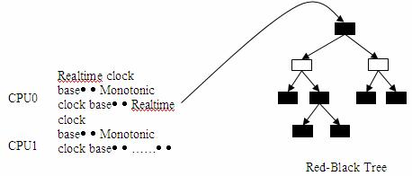

# Linux 时间管理 

## 名词解释

### HZ
Linux核心每隔固定周期会发出timer interrupt(IRQ 0),HZ是用来定义每一秒有几次timer interrupts。举例来说,HZ为1000,代表每秒1000次timer interrupt。

### Tick
Tick是HZ的倒数,即timer interrupt每发生一次中断时间。如HZ为250时,tick为4ms。

### Jiffies
Jiffies为Linux核心变数(32位元变数,unsigned long),它被用来记录系统开机后经过多少tick。每发生一次timer interrupt,Jiffies变量就会加1.

### 时钟源设备(Clock-source device)
系统中可以提供一定精度的计时设备都可以作为时钟源设备。如TSC、HPET、ACPI PM-Timer、PIT等。但是不同的时钟源提供的时钟精度是不一样的。像TSC,HPET等时钟源既支持高精度模式（high-resolution mode）也支持低精度模式(low-resolution mode),而PIT只能支持低精度模式。

时钟源的计时都是单调递增的(monotonically),如果时钟源的计时出现翻转(即返回到0值),很容易造成计时错误,内核的一个 patch(commit id: ff69f2)就是处理这类问题的一个很好示例。时钟源作为系统时钟的提供者,在可靠并且可用的前提下精度越高越好。在 Linux中不同的时钟源有不同的rating,具有更高rating的时钟源会优先被系统使用。

| 1 ~ 99 | 100 ~ 199 | 200 ~ 299 | 300 ~ 399 | 400 ~ 499 |
|--------| :-------: | :------: | :------: | :------: |
| 非常差的时钟源,只能作为最后的选择.如jiffies| 基本可以使用但并非理想的时钟源。如 PIT | 正确可用的时钟源。如 ACPI PM Timer，HPET | 快速并且精确的时钟源。如 TSC | 理想时钟源。如 kvm_clock，xen_clock |

### 时钟时间设备(Clock-event device)
系统中可以触发one-shot(单次)或者周期性中断的设备都可以作为时钟事件设备。如HPET,CPU Local APIC Timer等。HPET比较特别,它既可以做时钟源设备也可以做时钟事件设备。时钟事件设备的类型分为全局和per-CPU两种类型。全局的时钟事件设备虽然附属于某一个特定的 CPU上,但是完成的是系统相关的工作,例如完成系统的tick更新;per-CPU的时钟事件设备主要完成Local CPU上的一些功能,例如对在当前 CPU上运行进程的时间统计,profile,设置Local CPU上的下一次事件中断等。和时钟源设备的实现类似,时钟事件设备也通过rating来区分优先级关系。

### Tick device
Tick device用来处理周期性的tick event。Tick device其实是时钟事件设备的一个wrapper,因此tick device也有one-shot和周期性这两种中断触发模式。每注册一个时钟事件设备,这个设备会自动被注册为一个tick device。全局的tick device用来更新诸如jiffies 这样的全局信息，per-CPU的tick device则用来更新每个CPU相关的特定信息。

### Broadcast
Broadcast的出现是为了应对这样一种情况：假定CPU使用Local APIC Timer作为per-CPU的tick device，但是某些特定的CPU(如 Intel的Westmere之前的CPU)在进入C3+的状态时Local APIC Timer也会同时停止工作，进入睡眠状态。在这种情形下broadcast可以替代 Local APIC Timer继续完成统计进程的执行时间等有关操作。本质上broadcast是发送一个IPI(Inter-processor interrupt)中断给其他所有的CPU,当目标CPU收到这个IPI中断后就会调用原先Local APIC Timer正常工作时的中断处理函数,从而实现了同样的功能。目前主要在x86以及MIPS下会用到broadcast功能。

### Timekeeping & GTOD(Eeneric Time-of-Day)
Timekeeping(可以理解为时间测量或者计时)是内核时间管理的一个核心组成部分。没有Timekeeping,就无法更新系统时间,维持系统“心跳”。GTOD是一个通用的框架,用来实现诸如设置系统时间gettimeofday或者修改系统时间settimeofday等工作。


## Linux 定时器

在Linux内核中主要有两种类型的定时器。一类timeout类型，另一类timer类型。内核需要进行时钟管理,离不开底层的硬件支持。在早期是通过 8253 芯片提供的 PIT（Programmable Interval Timer）来提供时钟，但是 PIT 的频率很低，只能提供最高 1ms 的时钟精度，由于 PIT 触发的中断速度太慢，会导致很大的时延，对于像音视频这类对时间精度要求更高的应用并不足够，会极大的影响用户体验。随着硬件平台的不断发展变化，陆续出现了 TSC（Time Stamp Counter），HPET（High Precision Event Timer），ACPI PM Timer（ACPI Power Management Timer），CPU Local APIC Timer 等精度更高的时钟。这些时钟陆续被 Linux 的时钟子系统所采纳，从而不断的提高 Linux 时钟子系统的性能和灵活性。

### Timeout类型定时器
timeout 类型的定时器通常用于检测各种错误条件，例如用于检测网卡收发数据包是否会超时的定时器，IO 设备的读写是否会超时的定时器等等。通常情况下这些错误很少发生，因此，使用 timeout 类型的定时器一般在超时之前就会被移除，从而很少产生真正的函数调用和系统开销。总的来说，使用 timeout 类型的定时器产生的系统开销很小，它是下文提及的 timer wheel 通常使用的环境。此外，在使用 timeout 类型定时器的地方往往并不关心超时处理，因此超时精确与否，早 0.01 秒或者晚 0.01 秒并不十分重要，这在下文论述 deferrable timers 时会进一步介绍。

### Timer类型定时器
timer 类型的定时器与 timeout 类型的定时器正相反，使用 timer 类型的定时器往往要求在精确的时钟条件下完成特定的事件，通常是周期性的并且依赖超时机制进行处理。例如设备驱动通常会定时读写设备来进行数据交互。如何高效的管理 timer 类型的定时器对提高系统的处理效率十分重要，下文在介绍 hrtimer 时会有更加详细的论述。


### Timer wheel
在Linux 2.6.16之前,内核一直使用一种称为timer wheel的机制来管理时钟。这就是熟知的kernel一直采用的基于HZ的timer机制。

* Timer wheel核心数据结构:

```
#define TVN_BITS (CONFIG_BASE_SMALL ? 4 : 6) 
#define TVR_BITS (CONFIG_BASE_SMALL ? 6 : 8) 
#define TVN_SIZE (1 << TVN_BITS) 
#define TVR_SIZE (1 << TVR_BITS) 
#define TVN_MASK (TVN_SIZE - 1) 
#define TVR_MASK (TVR_SIZE - 1) 
 
struct tvec { 
       struct list_head vec[TVN_SIZE]; 
}; 
 
struct tvec_root { 
       struct list_head vec[TVR_SIZE]; 
}; 
 
struct tvec_base { 
       spinlock_t lock; 
       struct timer_list *running_timer; 
       unsigned long timer_jiffies; 
       unsigned long next_timer; 
       struct tvec_root tv1; 
       struct tvec tv2; 
       struct tvec tv3; 
       struct tvec tv4; 
       struct tvec tv5; 
} ____cacheline_aligned;
```

* Timer wheel核心处理函数

```
static inline void __run_timers(struct tvec_base *base) 
{ 
   struct timer_list *timer; 
 
   spin_lock_irq(&base->lock); 
   while (time_after_eq(jiffies, base->timer_jiffies)) { 
       struct list_head work_list; 
       struct list_head *head = &work_list; 
       int index = base->timer_jiffies & TVR_MASK; 
 
       /* 
        * Cascade timers: 
        */ 
       if (!index && 
           (!cascade(base, &base->tv2, INDEX(0))) && 
               (!cascade(base, &base->tv3, INDEX(1))) && 
                   !cascade(base, &base->tv4, INDEX(2))) 
           cascade(base, &base->tv5, INDEX(3)); 
       ++base->timer_jiffies; 
       list_replace_init(base->tv1.vec + index, &work_list); 
       while (!list_empty(head)) { 
           void (*fn)(unsigned long); 
           unsigned long data; 
 
           timer = list_first_entry(head, struct timer_list,entry); 
           fn = timer->function; 
           data = timer->data; 
           . . . . 
           fn(data); 
   . . . . 
}
```

#### Timer wheel弊端

##### cascade开销过大
在极端情况下,同时会有多个TV需要进行cascade处理,会产生很大的时延。这也是为什么说timeout类型的定时器是timer wheel的主要应用环境，或者说timer wheel是为timeout类型的定时器优化的。因为timeout类型的定时器的应用场景多是错误条件的检测，这类错误发生的机率很小，通常不到超时就被删除了，因此不会产生cascade的开销。

##### 时间精度
由于timer wheel是建立在HZ的基础上的，因此其计时精度无法进一步提高。毕竟一味的通过提高HZ值来提高计时精度并无意义，结果只能是产生大量的定时中断，增加额外的系统开销。因此，有必要将高精度的timer与低精度的timer分开，这样既可以确保低精度的timeout类型的定时器应用，也便于高精度的timer类型定时器的应用。

##### 强耦合
timer wheel的实现与jiffies的耦合性太强，非常不便于扩展。


### hrtimer(High-resolution Timer)
hrtimer首先要实现的功能就是要克服timer wheel的缺点,Linux Kernel2.6.16开始被引入。

#### hrtimer实现机制
hrtimer是建立在per-CPU时钟事件设备上的,对于一个SMP系统,如果只有全局的时钟事件设备,hrtimer无法工作。因为如果没有per-CPU时钟事件设备,时钟中断发生时系统必须产生必要的IPI中断来通知其他CPU完成相应的工作,而过多的IPI中断会带来很大的系统开销,这样会令使用hrtimer的代价太大,不如不用。为了支持hrtimer,内核需要配置CONFIG_HIGH_RES_TIMERS=y。hrtimer有两种工作模式：低精度模式(low-resolution mode)与高精度模式(high-resolution mode)。虽然hrtimer子系统是为高精度的timer准备的,但是系统可能在运行过程中动态切换到不同精度的时钟源设备,因此,hrtimer必须能够在低精度模式与高精度模式下自由切换。由于低精度模式是建立在高精度模式之上的,因此即便系统只支持低精度模式,部分支持高精度模式的代码仍然会编译到内核当中。

在低密度模式下,hrtimer的核心处理函数是hrtimer_run_queues,每一次tick中断都要执行一次。这个函数的调用流程为:

```
update_process_times 
   run_local_timers 
       hrtimer_run_queues
       raise_softirq(TIMER_SOFTIRQ)
```

低密度下hrtimer的核心处理函数:

```
void hrtimer_run_queues(void) 
{ 
   struct rb_node *node; 
   struct hrtimer_cpu_base *cpu_base = &__get_cpu_var(hrtimer_bases); 
   struct hrtimer_clock_base *base; 
   int index, gettime = 1; 
 
   if (hrtimer_hres_active()) 
       return; 
 
   for (index = 0; index < HRTIMER_MAX_CLOCK_BASES; index++) { 
       base = &cpu_base->clock_base[index]; 
 
       if (!base->first) 
           continue; 
 
       if (gettime) { 
           hrtimer_get_softirq_time(cpu_base); 
           gettime = 0; 
       } 
 
       raw_spin_lock(&cpu_base->lock); 
 
       while ((node = base->first)) { 
           struct hrtimer *timer; 
 
           timer = rb_entry(node, struct hrtimer, node); 
           if (base->softirq_time.tv64 <= 
                   hrtimer_get_expires_tv64(timer)) 
               break; 
 
           __run_hrtimer(timer, &base->softirq_time); 
       } 
       raw_spin_unlock(&cpu_base->lock); 
   } 
}
```

hrtimer_bases是实现hrtimer的核心数据结构,通过hrtimer_bases,hrtimer可以管理挂在每一个CPU上的所有timer。每个CPU上的 timer list不再使用timer wheel中多级链表的实现方式,而是采用了红黑树(Red-Black Tree)来进行管理。

```
DEFINE_PER_CPU(struct hrtimer_cpu_base, hrtimer_bases) = 
{ 
 
       .clock_base = 
       { 
               { 
                       .index = CLOCK_REALTIME, 
                       .get_time = &ktime_get_real, 
                       .resolution = KTIME_LOW_RES, 
               }, 
               { 
                       .index = CLOCK_MONOTONIC, 
                       .get_time = &ktime_get, 
                       .resolution = KTIME_LOW_RES, 
               }, 
       } 
};
```

* hrtimer时钟管理



每个hrtimer_bases都包含两个clock_base,一个是CLOCK_REALTIME类型的,另一个是CLOCK_MONOTONIC类型的。hrtimer可以选择其中之一来设置timer的expire time,可以是实际的时间,也可以是相对系统运行的时间。

在update_process_times中,除了处理处于低精度模式的hrtime外,还要唤醒IRQ0的softIRQ(TIMER_SOFTIRQ)以便执行timer wheel 的代码。由于hrtimer子系统的加入,在IRQ0的softIRQ中,还需要通过hrtimer_run_pending检查是否可以将hrtimer切换到高精度模式。

```
void hrtimer_run_pending(void) 
{ 
   if (hrtimer_hres_active()) 
       return; 
 
   /* 
    * This _is_ ugly: We have to check in the softirq context, 
    * whether we can switch to highres and / or nohz mode. The 
    * clocksource switch happens in the timer interrupt with 
    * xtime_lock held. Notification from there only sets the 
    * check bit in the tick_oneshot code, otherwise we might 
    * deadlock vs. xtime_lock. 
    */ 
   if (tick_check_oneshot_change(!hrtimer_is_hres_enabled())) 
       hrtimer_switch_to_hres(); 
}
```
如上代码,每一次触发IRQ0的softIRQ都需要检查一次是否可以将hrtimer切换到高精度,显然是十分低效的,希望有更好的方法不用每次都进行检查。

如果可以将hrtimer切换到高精度模式,则调用hrtimer_switch_to_hres函数进行切换。

```
/* 
* Switch to high resolution mode 
*/ 
static int hrtimer_switch_to_hres(void) 
{ 
   int cpu = smp_processor_id(); 
   struct hrtimer_cpu_base *base = &per_cpu(hrtimer_bases, cpu); 
   unsigned long flags; 
 
   if (base->hres_active) 
       return 1; 
 
   local_irq_save(flags); 
 
   if (tick_init_highres()) { 
       local_irq_restore(flags); 
       printk(KERN_WARNING "Could not switch to high resolution "
                 "mode on CPU %d\n", cpu); 
       return 0; 
   } 
   base->hres_active = 1; 
   base->clock_base[CLOCK_REALTIME].resolution = KTIME_HIGH_RES; 
   base->clock_base[CLOCK_MONOTONIC].resolution = KTIME_HIGH_RES; 
 
   tick_setup_sched_timer(); 
 
   /* "Retrigger" the interrupt to get things going */ 
   retrigger_next_event(NULL); 
   local_irq_restore(flags); 
   return 1; 
}
```
在这个函数中,首先使用tick_init_highres更新与原来的tick device绑定的时钟事件设备的event handler,例如将在低精度模式下的工作函数tick_handle_periodic/tick_handle_periodic_broadcast换成hrtimer_interrupt(它是hrtimer在高精度模式下的 timer 中断处理函数),同时将tick device的触发模式变为one-shot,即单次触发模式,这是使用dynamic tick或者hrtimer时tick device的工作模式。

由于dynamic tick可以随时停止和开始,以不规律的速度产生tick,因此支持one-shot模式的时钟事件设备是必须的;对于hrtimer,由于 hrtimer采用事件机制驱动timer前进,因此使用one-shot的触发模式也是顺理成章的。不过这样一来,原本tick device每次执行中断时需要完成的周期性任务如更新jiffies/wall time(do_timer)以及更新process的使用时间(update_process_times)等工作在切换到高精度模式之后就没有了,因此在执行完tick_init_highres之后紧接着会调用tick_setup_sched_timer函数来完成这部分设置工作。

```
void tick_setup_sched_timer(void) 
{ 
   struct tick_sched *ts = &__get_cpu_var(tick_cpu_sched); 
   ktime_t now = ktime_get(); 
   u64 offset; 
 
   /* 
    * Emulate tick processing via per-CPU hrtimers: 
    */ 
   hrtimer_init(&ts->sched_timer, CLOCK_MONOTONIC, HRTIMER_MODE_ABS); 
   ts->sched_timer.function = tick_sched_timer; 
 
   . . . . 
    
   for (;;) { 
       hrtimer_forward(&ts->sched_timer, now, tick_period); 
       hrtimer_start_expires(&ts->sched_timer, 
                  HRTIMER_MODE_ABS_PINNED); 
       /* Check, if the timer was already in the past */ 
       if (hrtimer_active(&ts->sched_timer)) 
           break; 
       now = ktime_get(); 
   } 
   . . . . 
}
```


这个函数使用tick_cpu_sched这个per-CPU变量来模拟原来tick device的功能。tick_cpu_sched本身绑定了一个hrtimer，这个 hrtimer的超时值为下一个tick，回调函数为tick_sched_timer。因此，每过一个tick，tick_sched_timer就会被调用一次，在这个回调函数中首先完成原来tick device的工作，然后设置下一次的超时值为再下一个tick，从而达到了模拟周期运行的tick device的功能。如果所有的CPU在同一时间点被唤醒，并发执行tick时可能会出现lock竞争以及cache-line冲突，为此Linux内核做了特别处理：如果假设 CPU 的个数为N，则所有的CPU都在tick_period前1/2的时间内执行tick 工作，并且每个CPU的执行间隔是tick_period/(2N)。

```
void tick_setup_sched_timer(void) 
{ 
   . . . . 
   /* Get the next period (per cpu) */ 
   hrtimer_set_expires(&ts->sched_timer, tick_init_jiffy_update()); 
   offset = ktime_to_ns(tick_period) >> 1; 
   do_div(offset, num_possible_cpus()); 
   offset *= smp_processor_id(); 
   hrtimer_add_expires_ns(&ts->sched_timer, offset); 
   . . . . 
}
```

随着hrtimer子系统的发展，一些问题也逐渐暴露了出来。一个比较典型的问题就是CPU的功耗问题。现代CPU都实现了节能的特性，在没有工作时CPU会主动降低频率，关闭CPU内部一些非关键模块以达到节能的目的。由于hrtimer的精度很高，触发中断的频率也会很高，频繁的中断会极大的影响CPU的节能。在这方面hrtimer一直在不断的进行调整。以下几个例子都是针对这一问题所做的改进。


```
/** 
* schedule_hrtimeout - sleep until timeout 
* @expires:    timeout value (ktime_t) 
* @mode:       timer mode, HRTIMER_MODE_ABS or HRTIMER_MODE_REL 
*/ 
int __sched schedule_hrtimeout(ktime_t *expires, const enum hrtimer_mode mode)
```

schedule_hrtimeout用来产生一个高精度的调度超时，以ns为单位。这样可以更加细粒度的使用内核的调度器。在Arjan van de Ven的最初实现中，这个函数有一个很大的问题: 由于其粒度很细，所以可能会更加频繁的唤醒内核，导致消耗更多的能源。为了实现既能节省能源，又能确保精确的调度超时，Arjan van de Ven的办法是将一个超时点变成一个超时范围。设置 hrtimerA的超时值有一个上限，称为hard expire，在hard expire这个时间点上设置hrtimer A的超时中断；同时设置hrtimer A的超时值有一个下限，称为 soft expire。在 soft expire到hard expire之间如果有一个hrtimer B的中断被触发，在 hrtimer B的中断处理函数中，内核会检查是否有其他 hrtimer的 soft expire超时了，譬如hrtimer A的soft expire超时了，即使hrtimer A的hard expire没有到，也可以顺带被处理。换言之，将原来必须在hard expire超时才能执行的一个点变成一个范围后，可以尽量把hrtimer中断放在一起处理，这样CPU被重复唤醒的几率会变小，从而达到节能的效果，同时这个hrtimer也可以保证其执行精度。


随着计算机系统的发展，对节能的需求越来越高，尤其是在使用笔记本，手持设备等移动环境是对节能要求更高。Linux 当然也会更加关注这方面的需求。hrtimer 子系统的优化尽量确保在使用高精度的时钟的同时节约能源，如果系统在空闲时也可以尽量的节能，则 Linux 系统的节能优势可以进一步放大。这也是引入 dynamic tick 的根本原因。

### Dynamic tick & tickless

在 dynamic tick 引入之前，内核一直使用周期性的基于 HZ 的 tick。传统的 tick 机制在系统进入空闲状态时仍然会产生周期性的中断，这种频繁的中断迫使 CPU 无法进入更深的睡眠。如果放开这个限制，在系统进入空闲时停止 tick，有工作时恢复 tick，实现完全自由的，根据需要产生 tick 的机制，可以使 CPU 获得更多的睡眠机会以及更深的睡眠，从而进一步节能。dynamic tick 的出现，就是为彻底替换掉周期性的 tick 机制而产生的。周期性运行的 tick 机制需要完成诸如进程时间片的计算，更新 profile，协助 CPU 进行负载均衡等诸多工作，这些工作 dynamic tick 都提供了相应的模拟机制来完成。由于 dynamic tick 的实现需要内核的很多模块的配合，包括了很多实现细节，这里只介绍 dynamic tick 的核心工作机制，以及如何启动和停止 dynamic tick。

#### Dynamic tick处理流程
从上文中可知内核时钟子系统支持低精度和高精度两种模式，因此 dynamic tick 也必须有两套对应的处理机制。从清单 5 中可以得知，如果系统支持 hrtimer 的高精度模式，hrtimer 可以在此从低精度模式切换到高精度模式。其实清单 5 还有另外一个重要功能：它也是低精度模式下从周期性 tick 到 dynamic tick 的切换点。如果当前系统不支持高精度模式，系统会尝试切换到 NOHZ 模式，也就是使用 dynamic tick 的模式，当然前提是内核使能了 NOHZ 模式。

```
tick_check_oneshot_change 
tick_nohz_switch_to_nohz 
   tick_switch_to_oneshot(tick_nohz_handler)
```

* 低密度模式下dynamic tick的核心处理函数

```
static void tick_nohz_handler(struct clock_event_device *dev) 
{ 
   struct tick_sched *ts = &__get_cpu_var(tick_cpu_sched); 
   struct pt_regs *regs = get_irq_regs(); 
   int cpu = smp_processor_id(); 
   ktime_t now = ktime_get(); 
 
   dev->next_event.tv64 = KTIME_MAX; 
 
   if (unlikely(tick_do_timer_cpu == TICK_DO_TIMER_NONE)) 
       tick_do_timer_cpu = cpu; 
 
   /* Check, if the jiffies need an update */ 
   if (tick_do_timer_cpu == cpu) 
       tick_do_update_jiffies64(now); 
   /* 
    * When we are idle and the tick is stopped, we have to touch 
    * the watchdog as we might not schedule for a really long 
    * time. This happens on complete idle SMP systems while 
    * waiting on the login prompt. We also increment the "start 
    * of idle" jiffy stamp so the idle accounting adjustment we 
    * do when we go busy again does not account too much ticks. 
    */ 
   if (ts->tick_stopped) { 
       touch_softlockup_watchdog(); 
       ts->idle_jiffies++; 
   } 
 
   update_process_times(user_mode(regs)); 
   profile_tick(CPU_PROFILING); 
 
   while (tick_nohz_reprogram(ts, now)) { 
       now = ktime_get(); 
       tick_do_update_jiffies64(now); 
   } 
}
```

在这个函数中，首先模拟周期性 tick device 完成类似的工作：如果当前 CPU 负责全局 tick device 的工作，则更新 jiffies，同时完成对本地 CPU 的进程时间统计等工作。如果当前 tick device 在此之前已经处于停止状态，为了防止 tick 停止时间过长造成 watchdog 超时，从而引发 soft-lockdep 的错误，需要通过调用 touch_softlockup_watchdog 复位软件看门狗防止其溢出。正如代码中注释所描述的，这种情况有可能出现在启动完毕，完全空闲等待登录的 SMP 系统上。最后需要设置下一次 tick 的超时时间。如果 tick_nohz_reprogram 执行时间超过了一个 jiffy，会导致设置的下一次超时时间已经过期，因此需要重新设置，相应的也需要再次更新 jiffies。这里虽然设置了下一次的超时事件，但是由于系统空闲时会停止 tick，因此下一次的超时事件可能发生，也可能不发生。这也正是 dynamic tick 根本特性。

在高精度模式下 tick_sched_timer 用来模拟周期性 tick device 的功能。dynamic tick 的实现也使用了这个函数。这是因为 hrtimer 在高精度模式时必须使用 one-shot 模式的 tick device，这也同时符合 dynamic tick 的要求。虽然使用同样的函数，表面上都会触发周期性的 tick 中断，但是使用 dynamic tick 的系统在空闲时会停止 tick 工作，因此 tick 中断不会是周期产生的。

#### Dynamic tick的开始和停止
当CPU进入空闲时是最好的时机。此时可以启动dynamic tick机制,停止tick; 反之在CPU从空闲中恢复到工作状态时,则可以停止dynamic tick。

* CPU在idle时dynamic tick的启动/停止设置

```
void cpu_idle(void) 
{ 
. . . . 
       while (1) { 
               tick_nohz_stop_sched_tick(1); 
               while (!need_resched()) { 
                          . . . . 
               } 
 
               tick_nohz_restart_sched_tick(); 
       } 
. . . . 
}
```

### timer子系统的初始化过程
系统刚上电时，需要注册 IRQ0 时钟中断，完成时钟源设备，时钟事件设备，tick device 等初始化操作并选择合适的工作模式。由于刚启动时没有特别重要的任务要做，因此默认是进入低精度 + 周期 tick 的工作模式，之后会根据硬件的配置（如硬件上是否支持 HPET 等高精度 timer）和软件的配置（如是否通过命令行参数或者内核配置使能了高精度 timer 等特性）进行切换。在一个支持 hrtimer 高精度模式并使能了 dynamic tick 的系统中，第一次发生 IRQ0 的软中断时 hrtimer 就会进行从低精度到高精度的切换，然后再进一步切换到 NOHZ 模式。IRQ0 为系统的时钟中断，使用全局的时钟事件设备（global_clock_event）来处理的。

```
static struct irqaction irq0  = { 
       .handler = timer_interrupt, 
       .flags = IRQF_DISABLED | IRQF_NOBALANCING | IRQF_IRQPOLL | IRQF_TIMER, 
       .name = "timer"
};
```

* 它的中断处理函数 timer_interrupt 的简化实现

```
static irqreturn_t timer_interrupt(int irq, void *dev_id) 
{ 
. . . . 
 
       global_clock_event->event_handler(global_clock_event);
. . . . 
       return IRQ_HANDLED; 
}
```

在 global_clock_event->event_handler 的处理中，除了更新 local CPU 上运行进程时间的统计，profile 等工作，更重要的是要完成更新 jiffies 等全局操作。这个全局的时钟事件设备的 event_handler 根据使用环境的不同，在低精度模式下可能是 tick_handle_periodic / tick_handle_periodic_broadcast，在高精度模式下是 hrtimer_interrupt。目前只有 HPET 或者 PIT 可以作为 global_clock_event 使用。

```
void __init time_init(void) 
{ 
       late_time_init = x86_late_time_init; 
} 
 
static __init void x86_late_time_init(void) 
{ 
       x86_init.timers.timer_init(); 
       tsc_init(); 
} 
 
/* x86_init.timers.timer_init 是指向 hpet_time_init 的回调指针 */ 
void __init hpet_time_init(void) 
{ 
       if (!hpet_enable()) 
               setup_pit_timer(); 
       setup_default_timer_irq(); 
}
```

系统优先使用 HPET 作为 global_clock_event，只有在 HPET 没有使能时，PIT 才有机会成为 global_clock_event。在使能 HPET 的过程中，HPET 会同时被注册为时钟源设备和时钟事件设备。

```
hpet_enable 
   hpet_clocksource_register 
hpet_legacy_clockevent_register 
   clockevents_register_device(&hpet_clockevent);
```

clockevent_register_device 会触发 CLOCK_EVT_NOTIFY_ADD 事件，即创建对应的 tick device。然后在 tick_notify 这个事件处理函数中会添加新的 tick device。

```
clockevent_register_device trigger event CLOCK_EVT_NOTIFY_ADD 
tick_notify receives event CLOCK_EVT_NOTIFY_ADD 
   tick_check_new_device 
       tick_setup_device
```

在 tick device 的设置过程中，会根据新加入的时钟事件设备是否使用 broadcast 来分别设置 event_handler。
