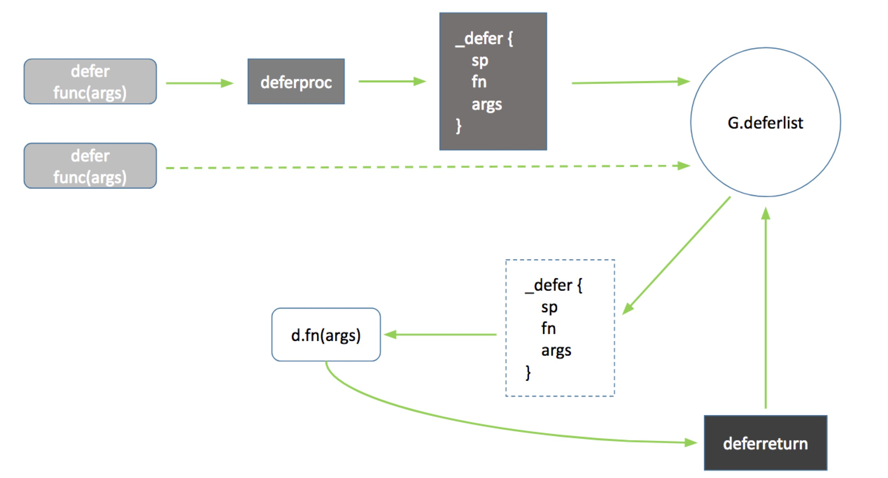
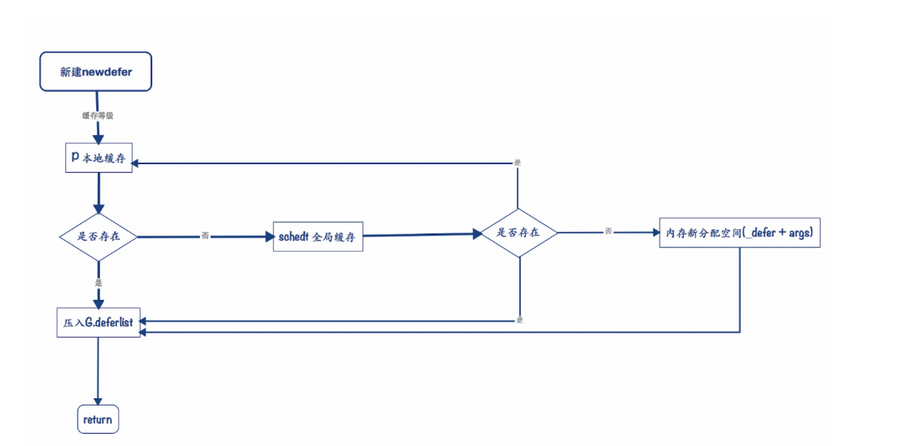

# Defer
defer是Go语言一个关键字,延迟调用。defer最大的优势是,即使函数执行出错,依然能保证回收资源等操作得以执行。但如果对性能有要求,且错误能被控制,那么还是直接执行比较好。


## defer 实现
通过一个实例进行反汇编找到defer实现的入口。

```
package main

func main() {
	defer println(0x11)
} 
```

* 反汇编

```
0x000000000104e03d <+29>: mov    QWORD PTR [rsp+0x10],0x11  // 参数0x11
0x000000000104e046 <+38>: mov    DWORD PTR [rsp],0x8        // 参数长度
0x000000000104e04d <+45>: lea    rax,[rip+0x20d2c]          // println(0x11)

0x000000000104e054 <+52>: mov    QWORD PTR [rsp+0x8],rax    // IP 指向下一条
0x000000000104e059 <+57>: call   0x10209a0 <runtime.deferproc>
0x000000000104e05e <+62>: test   eax,eax
0x000000000104e060 <+64>: jne    0x104e074 <main.main+84>
0x000000000104e062 <+66>: jmp    0x104e064 <main.main+68>
0x000000000104e064 <+68>: nop
0x000000000104e065 <+69>: call   0x1021220 <runtime.deferreturn>
0x000000000104e06a <+74>: mov    rbp,QWORD PTR [rsp+0x18]
0x000000000104e06f <+79>: add    rsp,0x20
0x000000000104e073 <+83>: ret
```
编译器将defer处理成两个函数调用,deferproc定义一个延迟调用对象,然后再函数结束前通过deferreturn完成最终调用。


### defer 延迟调用实现流程

#### 实现流程


#### 流程图



### 具体实现

#### _defer 结构体

```
type _defer struct {
    siz     int32    // _defer 大小
    started bool
    sp      uintptr  // 调用deferproc时的SP
    pc      uintptr  // 调用deferproc时的IP
    fn      *funcval
    _panic  *_panic  // panic that is running defer
    link    *_defer
} 
```

#### deferproc
注册延迟调用,共使用deferproc和newdefer两个函数完成。

```
deferproc(siz int32, fn *funcval) {
    // Stack frame layout(stack 框架布局)
    //
    // (x86)
    // +------------------+
    // | args from caller |
    // +------------------+ <- frame->argp(调用者参数的栈帧)
    // |  return address  |
    // +------------------+
    // |  caller's BP (*) | (*) if framepointer_enabled && varp < sp
    // +------------------+ <- frame->varp
    // |     locals       |
    // +------------------+
    // |  args to callee  |
    // +------------------+ <- frame->sp
    //
    // (arm)
    // +------------------+
    // | args from caller |
    // +------------------+ <- frame->argp
    // | caller's retaddr |
    // +------------------+ <- frame->varp
    // |     locals       |
    // +------------------+
    // |  args to callee  |
    // +------------------+
    // |  return address  |
    // +------------------+ <- frame->sp
    //
    //
    // deferproc stack栈帧空间不包含fn的参数.所以在参数被复制完成之前,GC和stack复制操作不会被触发。
    // 主要保证不会被回收.
    sp := getcallersp()         // 调用deferproc时的sp
    argp := uintptr(unsafe.Pointer(&fn)) + unsafe.Sizeof(fn)                // 调用者参数栈帧
    callerpc := getcallerpc()   // 调用deferproc时的pc

    // 1. 创建defer函数,然后放到G._defer链表.
    // 2. defer创建要提前于panic
    d := newdefer(siz)
    if d._panic != nil {
        throw("deferproc: d.panic != nil after newdefer")
    }
    d.fn = fn         // defer 注册的函数
    d.pc = callerpc
    d.sp = sp

    // 延迟调用参数内存在_defer类型之后
    // siz 参数大小
    switch siz {
    case 0:
        // Do nothing.
    case sys.PtrSize:
        // 指针参数
        *(*uintptr)(deferArgs(d)) = *(*uintptr)(unsafe.Pointer(argp))
    default:
        // 非指针
        memmove(deferArgs(d), unsafe.Pointer(argp), uintptr(siz))
    }

    // 正常返回0
    return0()
}
```


#### newdefer
```
// +------------------------------------+
// |func main() {                       |
// |    // defer 1                      |
// |    defer func() {                  |
// |                                    |
// |    }()                             |
// |                                    |
// |    // defer 2                      |
// |    defer func() {                  |
// |                                    |
// |    }()                             |
// |                                    |
// |    // defer 3                      |
// |    defer func() {                  |
// |                                    |
// |    }()                             |
// |}                                   |
// +------------------------------------+
//
//
//                 栈顶
//           +--------------------+
//           |type _defer struct{ |
//           |    sp              |
//  defer3   |    siz             |
//           |    fn              |
//           |    args            |
//           |    link            |
//           +------+-------------+
//                  |
//                  |
//           +------v-------------+
//           |type _defer struct{ |
//           |    sp              |
//  defer2   |    siz             |    FILO
//           |    fn              |
//           |    args            |
//           |    l|nk            |
//           +-----+--------------+
//                 |
//                 |
//           +-----v--------------+
//           |type _defer struct{ |
//           |    sp              |
//  defer1   |    siz             |
//           |    fn              |
//           |    args            |
//           |    link            |
//           +--------------------+
//                 栈底
//
//
//go:nosplit
func newdefer(siz int32) *_defer {
     var d *_defer

     // 参数长度对齐后,获取缓存等级
     sc := deferclass(uintptr(siz))
     gp := getg()

     // 未超出缓存大小
     if sc < uintptr(len(p{}.deferpool)) {
         // 1. 如果P本地缓存空的;全局队列(sched)有sc类型_defer数据结构。
         // 2. 从全局队列获取一批_defer到本地。
         pp := gp.m.p.ptr()     // P struct
         if len(pp.deferpool[sc]) == 0 && sched.deferpool[sc] != nil {
             // 通过系统stack创建_defer,确保创建的_derfer栈不会被扩容.
             // Slow!!!
             systemstack(func() {
                 lock(&sched.deferlock)
                 for len(pp.deferpool[sc]) < cap(pp.deferpool[sc])/2 && sched.deferpool[sc] != nil {
                     // 从全局队列获取_defer类型
                     d := sched.deferpool[sc]
                     sched.deferpool[sc] = d.link
                     d.link = nil
                     pp.deferpool[sc] = append(pp.deferpool[sc], d)   // 缓存到P本地缓存
                 }
                 unlock(&sched.deferlock)
             })
         }

         // 如果P本地缓存有该类型_defer数据结构,则从P本地缓存获取
         if n := len(pp.deferpool[sc]); n > 0 {
             // 从P局部队列获取_defer
             d = pp.deferpool[sc][n-1]
             pp.deferpool[sc][n-1] = nil
             pp.deferpool[sc] = pp.deferpool[sc][:n-1]
         }
     }

     // 如果本地缓存和全局缓存都没有获取到_defer,则新分配空间(_defer＋ args)
     if d == nil {
         // total = deferHeaderSize + siz
         // _defer{} 大小 + defer参数大小
         systemstack(func() {
             total := roundupsize(totaldefersize(uintptr(siz)))
             d = (*_defer)(mallocgc(total, deferType, true))
         })
     }


     d.siz = siz           // defer 函数参数大小
     d.link = gp._defer    // 内层defer,将d保存到G._defer链表

     gp._defer = d         // 当前defer压入g(G._defer)
     return d
}
```


### deferreturn 实现
编译器在调用任何函数的末尾插入对defer函数的调用.

```
//go:nosplit
func deferreturn(arg0 uintptr) {
     gp := getg()

     // 获取defer延迟调用对象
     d := gp._defer
     if d == nil {
         return
     }

     // sp - 调用deferreturn时的sp.和调用deferproc时sp相同.
     // d.sp != sp,避免调用其它stack的延迟函数
     sp := getcallersp()
     if d.sp != sp {
         return
     }

     // 将延迟函数的参数复制到stack.
     switch d.siz {
     case 0:
         // Do nothing.
     case sys.PtrSize:
         *(*uintptr)(unsafe.Pointer(&arg0)) = *(*uintptr)(deferArgs(d))
     default:
         memmove(unsafe.Pointer(&arg0), deferArgs(d), uintptr(d.siz))
     }
     fn := d.fn
     d.fn = nil

     // 调整G._defer链表
     gp._defer = d.link

     // 释放_defer
     freedefer(d)

     // 执行延迟函数
     jmpdefer(fn, uintptr(unsafe.Pointer(&arg0)))
}
```

#### freedefer释放_defer
```
func freedefer(d *_defer) {
     // 确保d._panic为空
     if d._panic != nil {
         freedeferpanic()
     }

     // 确保d.fn为空
     if d.fn != nil {
         freedeferfn()
     }

     // 参数长度对齐后,获取缓存等级
     sc := deferclass(uintptr(d.siz))

     // 参数长度超出缓存大小
     if sc >= uintptr(len(p{}.deferpool)) {
         return
     }

     pp := getg().m.p.ptr()


     // 本地P缓存满了,则将P缓存一半儿数据移到全局缓存
     if len(pp.deferpool[sc]) == cap(pp.deferpool[sc]) {
         systemstack(func() {
             var first, last *_defer
             for len(pp.deferpool[sc]) > cap(pp.deferpool[sc])/2 {
                 n := len(pp.deferpool[sc])    // P本地缓存长度
                 d := pp.deferpool[sc][n-1]    // P本地缓存最后一个_defer

                 // P本地缓存中删除最后一个数据
                 pp.deferpool[sc][n-1] = nil
                 pp.deferpool[sc] = pp.deferpool[sc][:n-1]

                 // linked table
                 if first == nil {
                     first = d
                 } else {
                     last.link = d
                 }
                 last = d
             }

             // P本地缓存一半儿_der放到全局缓存中
             lock(&sched.deferlock)
             last.link = sched.deferpool[sc]
             sched.deferpool[sc] = first
             unlock(&sched.deferlock)
         })
     }


     // *d = _defer{}
     d.siz = 0
     d.started = false
     d.sp = 0
     d.pc = 0
     d.link = nil

        // 将释放的_defer,放到P本地缓存中.
        // 下次使用时,直接从本次缓存中获取.
     pp.deferpool[sc] = append(pp.deferpool[sc], d)
}
```

#### jmpdefer延迟函数被执行
```
//
//
//                  +---------------------------------+ rsp-0x8  => rbp
//                  |                                 |
//                  |                                 |
// +---------------->     defer function fn address   |
// |                |                                 |
// |                |                                 |
// |                +---------------------------------+ SP <-------------------------+
// |                |                                 |                              |
// |                |                                 |                              |
// |                |          rsp-0x5        --------+---------------+              |
// |                |                                 |               |              |
// |                +---------------------------------+ rsp+0x8       |              |
// |                |                                 |               |              |
// |                |                                 |               |              |
// +----------------|    defer function fn address    |               |              |
//                  |                                 |               |              |
//                  +---------------------------------+ rsp+0x10      |              |
//                  |                                 |               |              |    rbx
//                  |                                 |               |         +----+-----++-----------------------+
//                  |            main sp  ------------+---------------+-------> |          ||                       |
//                  |                                 |               |         | main ip  ||                       |
//                  +---------------------------------+ rsp+0x18      |         |          ||                       |
//                  |                                 |               |         +----------++-----------------------+
//                  |                                 |               |
//       jmpdefer   |                                 |               |      rbx-0x8
//                  |                                 |               |
//                  |                                 |               |
//                  |                                 |               |
//                  |                                 |               |
//                  |                                 |               |
//                  |                                 |               |
//                  |                                 |               |
//                  |                                 |               |
//                  |                                 |               |
//                  |                                 |               |
//                  |                                 |               |
//                  |                                 |               |
//                  +---------------------------------+  main sp      |
//                  |                                 |               |
//                  |                                 |               |
//                  |                                 |               |
//                  +---------------------------------+ deferreturn<--+
//                  |                                 +--------------------------> Call deferreturn
//                  |                                 |
//                  +---------------------------------+ main ip
//       main.main  |                                 |
//                  |                                 |
//                  |                                 |
//                  |                                 |
//                  |                                 |
//                  |                                 |
//                  |                                 |
//                  |                                 |
//                  +---------------------------------+
TEXT runtime·jmpdefer(SB), NOSPLIT, $0-16
 MOVQ    fv+0(FP), DX    // 延迟函数fn地址
 MOVQ    argp+8(FP), BX  // main SP
 LEAQ    -8(BX), SP      // main IP
 MOVQ    -8(SP), BP      // restore BP as if deferreturn returned (harmless if framepointers not in use)
 SUBQ    $5, (SP)        // main.deferreturn 指令地址
 MOVQ    0(DX), BX       // 执行fn函数
 JMP BX                  // but first run the deferred function
```