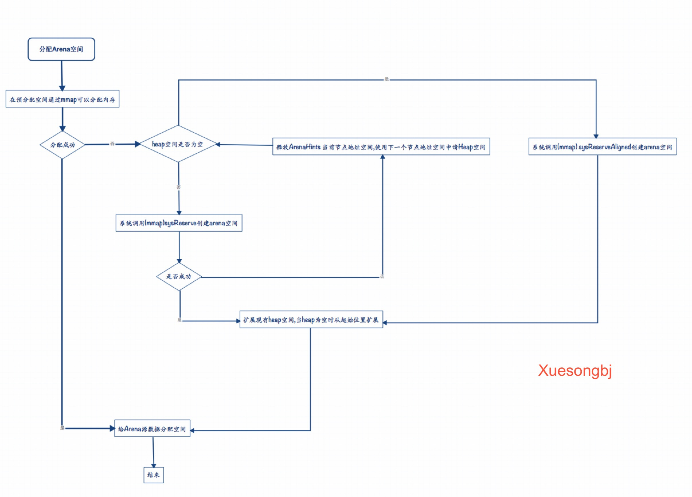
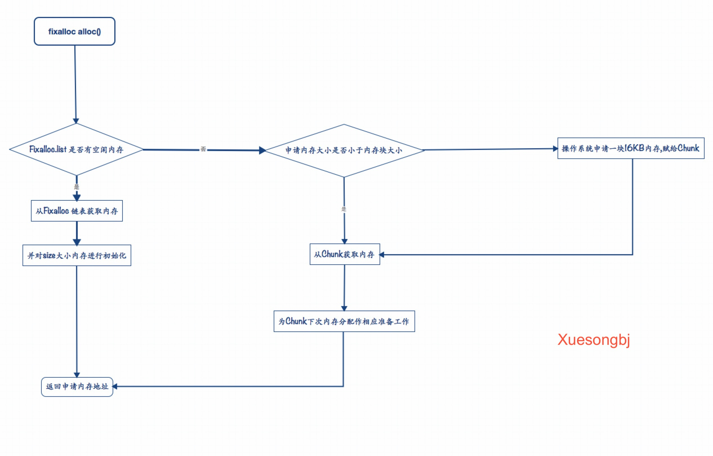
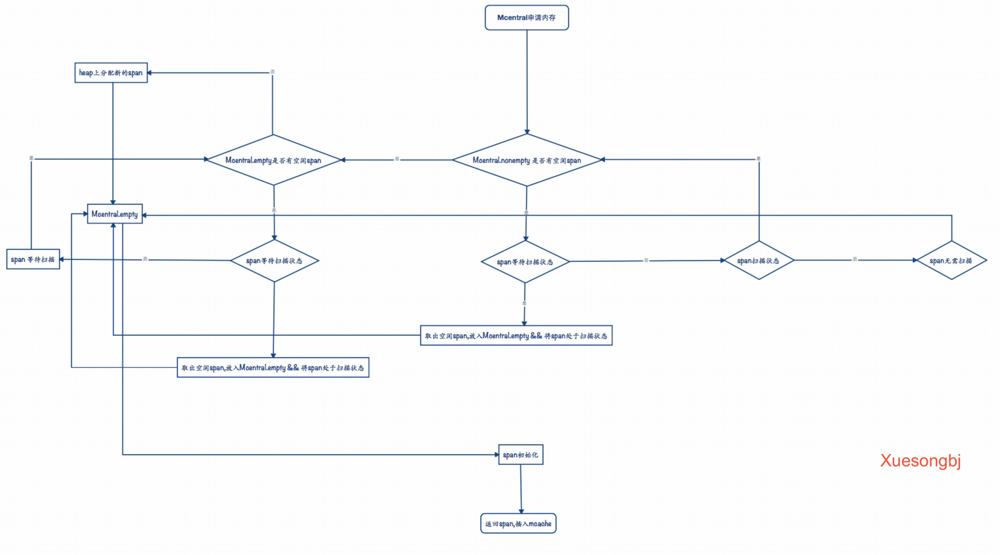

# Go内存分配器


## Malloc初始化

### Mallocinit
```
func mallocinit() {
	// 初始化规格对照表
	testdefersizes()


	// heap初始化
	mheap_.init()

	// 为当前线程绑定cache对象
	_g_ := getg()
	_g_.m.mcache = allocmcache()

	// 初始化arena
	// 64位操作系统
	if sys.PtrSize == 8 && GOARCH != "wasm" {
		for i := 0x7f; i >= 0; i-- {
			var p uintptr
			switch {
			case GOARCH == "arm64" && GOOS == "darwin":
				p = uintptr(i)<<40 | uintptrMask&(0x0013<<28)
			case GOARCH == "arm64":
				p = uintptr(i)<<40 | uintptrMask&(0x0040<<32)
			case raceenabled:
				// The TSAN runtime requires the heap
				// to be in the range [0x00c000000000,
				// 0x00e000000000).
				p = uintptr(i)<<32 | uintptrMask&(0x00c0<<32)
				if p >= uintptrMask&0x00e000000000 {
					continue
				}
			default:                                                                                                      
				//     +--------------------+-----------------------------------------------+-------------------------------+
				//     |                    |                                               |                               |
				//     |                    |                                               |                               |
				//     |      0x7f          |                                               |             0x00c0            |
				//     |                    |                                               |                               |
				//     |                    |                                               |                               |
				//     +--------------------+-----------------------------------------------+-------------------------------+
				//                          ^                                                                                
				//             8bit         |                                                             16Bit              
				//                          |                                                                                
				//                          |                                                                                
				//                          |                                                                                
				//                          |                                                                                
				// +----------------------------------------------------+                                                    
				// |          0x00c0 << 32 ==> 0xc000000000             |                                                    
				// +----------------------------------------------------+ 
				// 设置从0xc000000000位置开始保留地址                                            
				p = uintptr(i)<<40 | uintptrMask&(0x00c0<<32)
			}

			hint := (*arenaHint)(mheap_.arenaHintAlloc.alloc())  // 使用arenaHintAlloc 分配内存,初始化分配大小16KB
			hint.addr = p     // areana开始地址

			// Arena是一个链表数据结构
			// hint.next是下一个arena
			// heap_.arenaHints是heap在arena开始地址
			hint.next, mheap_.arenaHints = mheap_.arenaHints, hint   
		}
	} else {
		// 32位操作系统初始化arena
		// 略...
	}
}
```

## Arena申请内存
Arena向操作系统申请内存(mmap)。

* ArenaHints 是一个地址范围。当真正申请heap空间时,在该区域进行申请。使用单向链表结构进行链接。
* Arena区域申请内存,一般申请的内存100KB或1MB。使用的时候,需要重新初始化。按heapArenaBytes进行对齐(分配空间时,进行加锁处理)。

### SysAlloc

```
func (h *mheap) sysAlloc(n uintptr) (v unsafe.Pointer, size uintptr) {
	// 按heapArenaBytes内存对齐
	n = round(n, heapArenaBytes)

	// 提前预留arena大小空间,然后根据需要进行映射.
	v = h.arena.alloc(n, heapArenaBytes, &memstats.heap_sys)
	if v != nil {
		size = n
		goto mapped
	}

	// Arena空间增长,初始化时,默认分配16KB空间.
	for h.arenaHints != nil {
		// 当前heap地址(Arena扩容开始地址)
		hint := h.arenaHints
		p := hint.addr


		// 通过系统调用创建arena空间
		if p+n < p {
			// We can't use this, so don't ask.
			v = nil
		} else if arenaIndex(p+n-1) >= 1<<arenaBits {
			// Outside addressable heap. Can't use.
			v = nil
		} else {
			// 在Arena空间创建n字节大小空间
			v = sysReserve(unsafe.Pointer(p), n)
		}


		// 创建成功;arena空间增长
		if p == uintptr(v) {
			// Success. Update the hint.
			if !hint.down {
				p += n
			}
			hint.addr = p    // 扩容后新的Arena空间
			size = n         // 扩容字节大小
			break
		}
		
		// 如果创建失败,则释放当前空间;在下一个arena空间创建
		if v != nil {
			sysFree(v, n, nil)
		}


		h.arenaHints = hint.next
		h.arenaHintAlloc.free(unsafe.Pointer(hint))
	}

	if size == 0 {
		// 如果所有的arena节点都失败了,则使用操作系统给的任意地址.
		v, size = sysReserveAligned(nil, n, heapArenaBytes)

		// 创建一个新的arena,扩展现有区域.
		hint := (*arenaHint)(h.arenaHintAlloc.alloc())
		hint.addr, hint.down = uintptr(v), true
		hint.next, mheap_.arenaHints = mheap_.arenaHints, hint

		hint = (*arenaHint)(h.arenaHintAlloc.alloc())
		hint.addr = uintptr(v) + size
		hint.next, mheap_.arenaHints = mheap_.arenaHints, hint
	}

	// Back the reservation.
	sysMap(v, size, &memstats.heap_sys)
mapped:
	// 	+---------------------+-------------------------------+---------------------------------------------+                                                     
	// |                     |                                |                                             |                                                     
	// |                     |                                |                                             |                                                     
	// |                     |                                |                                             |                                                     
	// |         Span        |            Bitmap              |                   Arena                     |                                                     
	// |                     |                                |                                             |                                                     
	// |                     |                                |                                             |                                                     
	// |                     |                                |                                             |                                                     
	// +---------------------+-------------+------------------+---------------------------------------------+                                                     
	//                                     |                  ^                                                                                                   
	//                                     |                  |                                                                                                   
	//                                     |                  |                                                                                                   
	//                                     |                  |                                                                                                   
	//                                     |                  |                                                                                                   
	//                                     |                  |                                                                                                   
	//                                     |                  |                                                                                                   
	//                                     |                  |                                                                                                   
	//                                     |                  |                                                                                                   
	//                                     |                  |                                                                                                   
	//                                     |                  |                                                                                                   
	//                                     |                  |                                                                                                   
	//                                     |                  |           +---------+---------+--------+--------+--------+--------+--------+--------+             
	//                                     |                  |           |         |         |        |        |        |        |        |        |      L1     
	//                                     +------------------+---------->|         |         |        |        |        |        |        |        |             
	//                                                        |           |         |         |        |        |        |        |        |        |             
	//                                                        |           +----+----+---------+--------+--------+--------+--------+--------+---+----+             
	//                                                        |                |                                                               |                  
	//                                                        |                |                                                               |                  
	//                                                        |                |                                                               |                  
	//                                                        |                |                                                               |                  
	//                                                        |           +----v----+                                                          v                  
	//                                                        |           |         |                                                     +---------+             
	//                                                        |           |         |                                                     |         |             
	//                                                        |           +---------+                                                     +---------+             
	//                                                        |           |         |                                                     |         |             
	//                                                        |           |         |                                                     |         |             
	//                                                        |           |         |                                                     |         |             
	//                                                        |           +---------+                                                     +---------+             
	//                                                        |           |         |                                                     |         |             
	//                                                        +-----------+  0xc0   |                                                     |         |             
	//                                                                    |         |                                                     |         |             
	//                                                                    +---------+                                                     +---------+             
	//                                                                    |         |                                                     |         |             
	//                                                                    |         |                                                     |         |             
	//                                                                    |         |                                                     |         |             
	//                                                                    +---------+                                                     |         |             
	//                                                                                                                                    +---------+             
	//                                                                                                                                                           
	//                                                                       L2                                                              L2                  
	//                                                                                                                                                           
	//                                                                                                                                                           
	// 创建arena源数据
	// arenaIndex计算此数组的索引(L1索引)
	for ri := arenaIndex(uintptr(v)); ri <= arenaIndex(uintptr(v)+size-1); ri++ {
		// L2 arena分配空间
		l2 := h.arenas[ri.l1()]
		if l2 == nil {
			l2 = (*[1 << arenaL2Bits]*heapArena)(persistentalloc(unsafe.Sizeof(*l2), sys.PtrSize, nil))
			atomic.StorepNoWB(unsafe.Pointer(&h.arenas[ri.l1()]), unsafe.Pointer(l2))
		}


		// heapArena存储arena源数据。heapArena存储在heap外空间,通过mheap_.arenas进行访问.
		// heapArena直接从操作系统分配的,理想情况下它应该是一个系统page页的倍数
		var r *heapArena

		// 仅用于32位平台
		// heapArenaAlloc是预先保留的空间,用于分配heapArena对象.
		// linearAlloc.alloc()
		r = (*heapArena)(h.heapArenaAlloc.alloc(unsafe.Sizeof(*r), sys.PtrSize, &memstats.gc_sys))
		if r == nil {
			// 64位平台,分配heapArena对象
			r = (*heapArena)(persistentalloc(unsafe.Sizeof(*r), sys.PtrSize, &memstats.gc_sys))
		}

		// heapArena分配空间
		atomic.StorepNoWB(unsafe.Pointer(&l2[ri.l2()]), unsafe.Pointer(r))
	}
	return
}
```

### Arena申请内存流程图




## FixAlloc内存分配器
FixAlloc是Go默认内存分配器,用于管理Mcache和Mspan对象。默认情况下,FixAlloc分配的内存默认用0填充,可以通过设置zero标识位进行设置。


### FixAlloc实现

```
type fixalloc struct {
	size   uintptr                     	// 分配内存块规格大小尺寸
	first  func(arg, p unsafe.Pointer) 	// called first time p is returned
	arg    unsafe.Pointer
	list   *mlink                      	// 内存块链表
	chunk  uintptr 					   		// 内存块分配开始地址
	nchunk uint32
	inuse  uintptr 							// 内存已用字节数
	stat   *uint64							// 计数器
	zero   bool 								// 初始化内存是否使用0填充,默认true
}
```

```
func (f *fixalloc) alloc() unsafe.Pointer {
	// 如果内存块链表不为空,直接使用获取的内存块
	if f.list != nil {
		v := unsafe.Pointer(f.list)
		f.list = f.list.next        // 使用的内存块从链表删除,指针指向下一个内存块
		f.inuse += f.size

		// 从v开始清除f.size字节
		if f.zero {
			memclrNoHeapPointers(v, f.size)
		}
		return v
	}

	// 申请内存大小大于内存块大小,按16KB大小从操作系统申请
	if uintptr(f.nchunk) < f.size {
		f.chunk = uintptr(persistentalloc(_FixAllocChunk, 0, f.stat))
		f.nchunk = _FixAllocChunk
	}

	v := unsafe.Pointer(f.chunk)   // 分配空间开始地址
	if f.first != nil {
		f.first(f.arg, v)
	}

	f.chunk = f.chunk + f.size     // 下次分配开始地址
	f.nchunk -= uint32(f.size)     // 如果下次申请内存小于n.nchunk字节,直接从f.chunk位置开始申请内存
	f.inuse += f.size              // 使用内存空间计数器
	return v
}
```

### FixAlloc 流程图




## 对象内存分配
通过mallocgc給对象分配内存。像new()、make()函数都是通过调用mallocgc函数实现。对于小于32KB小对象,通过mcache进行分配;大于32KB对象直接在heap进行内存分配;对于小于16Byte微小对象,使用Tiny allocator进行分配,尽可能保证内存不被浪费。使用Tiny allocator分配器进行内存分配的对象不能包含指针类型。


### Mallocgc 实现

```
func mallocgc(size uintptr, typ *_type, needzero bool) unsafe.Pointer {
	// 申请空间大小0字节,用0进行填充
	if size == 0 {
		return unsafe.Pointer(&zerobase)
	}

	// 是否使用内存分配器进行内存分配,默认采用内存分配器分配(debug.sbrk == 0)
	if debug.sbrk != 0 {
		align := uintptr(16)
		if typ != nil {
			align = uintptr(typ.align)
		}

		// 通过mmap分配内存,该内存被分配在系统stack(因为stack增长,需要使用它)
		return persistentalloc(size, align, &memstats.other_sys)
	}

	// 当前线程上锁
	mp := acquirem()

	// 抢占内存分配信号,一旦被抢占其它分配操作则处于阻塞
	mp.mallocing = 1

	shouldhelpgc := false

	// 内存申请大小
	dataSize := size

	// 本地P Cache
	c := gomcache()

	var x unsafe.Pointer
	noscan := typ == nil || typ.kind&kindNoPointers != 0   // 非指针数据类型


	// 小对象(<32kB)
	if size <= maxSmallSize {
		// 1. 微型对象采用Tiny allocator进行分配.
		// 2. 对象不能包含指针类型,尽可能保证内存不被浪费.
		// 3. Tiny allocator将几个微小对象的分配请求组合到一个内存块(节约内存).当所有对象引用计数为0时,对这块内存进行释放(通过SetFinalizer修改所有对象是否可以被回收,当所有对象可被回收时。才会被GC扫描比较微可回收)
		if noscan && size < maxTinySize {
			// 存储对象便宜量,开始时为0
			off := c.tinyoffset

			// 内存对齐
			if size&7 == 0 {
				off = round(off, 8)
			} else if size&3 == 0 {
				off = round(off, 4)
			} else if size&1 == 0 {
				off = round(off, 2)
			}

			// 有可用的tiny block,在对象被放在tiny block内
	        // 		                                                                  +---------------------------------------------------+
            //                                                                        |                                                   |
            //                                                         +--------------|                                                   |
            //                                                         |              |                                                   |
            //                                                         |              +---------------------------------------------------+
            //                                                         |                                                                   
            //                                                         |                         New object - sizeof(8 byte)               
            //                                                         |                                                                   
            //                                                         |                                                                   
            //                                                         |                                                                   
            //                                                         |                                                                   
            //                                                         |                                                                   
            //                                                         v                                                                   
            //       +-------------------------------------------------+------------------------------------------------+                  
            //       |                                                 |                                                |                  
            //       |                                                 |                                                |                  
            //       |                  8 Byte                         |                                                |                  
            //       |                                                 |                                                |                  
            //       +-------------------------------------------------+------------------------------------------------+                  
            //                                                                                                                             
            //     0 byte                                            offset                                          maxTinySize            
            //                                                                                                                             
            //                                                                                                                             
			//                                                               
            //                                                                                                                             
            //                                                     Tiny block                                                              
                                                                                                                            
			if off+size <= maxTinySize && c.tiny != 0 {
				// 在tiny block申请内存
				x = unsafe.Pointer(c.tiny + off)     // 插入位置指针
				c.tinyoffset = off + size            // 插入后tiny block指针位置
				c.local_tinyallocs++                 // 当前tiny blcok 存储对象计数器自加
				mp.mallocing = 0                     // 释放内存分配信号
				releasem(mp)                         // 释放线程
				return x                             
			}

			// 1. 新分配一个Tiny block,从本地P mcache中按tinySpanClass规格大小内存分配.
			// 2. 如果本次Cache中没有,则需要从mcentral申请内存到mcache中.
			// 3. 如果从mcentral中申请内存,则需要重新启动GC循环.
			span := c.alloc[tinySpanClass]
			v := nextFreeFast(span)
			if v == 0 {
				// 如果填满mcache,触发GC
				v, _, shouldhelpgc = c.nextFree(tinySpanClass)
			}

			// 申请到的内存空间进行初始化操作(零值)
			x = unsafe.Pointer(v)
			(*[2]uint64)(x)[0] = 0
			(*[2]uint64)(x)[1] = 0

			
			// 根据剩余大小空间,决定是否需要换tiny block 
			if size < c.tinyoffset || c.tiny == 0 {
				// 用新块替换
				c.tiny = uintptr(x)
				c.tinyoffset = size
			}

			// 消费一个新的完整tiny块
			size = maxTinySize
		} else {
			// 根据对象大小,使用不同规格span存储对象:
			// 1. size_to_class8 用于对象小于1kB对象
			// 2. size_to_class129用于1kB ~ 32kB大小对象
			var sizeclass uint8
			if size <= smallSizeMax-8 {
				sizeclass = size_to_class8[(size+smallSizeDiv-1)/smallSizeDiv]
			} else {
				sizeclass = size_to_class128[(size-smallSizeMax+largeSizeDiv-1)/largeSizeDiv]
			}

			size = uintptr(class_to_size[sizeclass])    
			spc := makeSpanClass(sizeclass, noscan)     // span规格
			span := c.alloc[spc]                        // 根据span大小规格从mcache中申请内存
			v := nextFreeFast(span)
			if v == 0 {
				// 如果mcache中没有空间,则从mcentral申请内存放到mcache中
				v, span, shouldhelpgc = c.nextFree(spc)
			}
			x = unsafe.Pointer(v)

			// 对申请内存进行初始化
			if needzero && span.needzero != 0 {
				memclrNoHeapPointers(unsafe.Pointer(v), size)
			}
		}
	} else {
		// 大对象(>32kB)
		// 从heap上分配内存
		var s *mspan
		shouldhelpgc = true
		systemstack(func() {
			s = largeAlloc(size, needzero, noscan)
		})

		s.freeindex = 1    // span槽位索引
		s.allocCount = 1   // 已分配对象数量

		// span rename s.base().
		// x - span开始地址
		x = unsafe.Pointer(s.base())

		// 对象大小
		size = s.elemsize
	}


	// 在bitmap做标记...
	// 检查触发条件,启动垃圾回收
	var scanSize uintptr
	if !noscan {
		heapBitsSetType(uintptr(x), size, dataSize, typ)
		if dataSize > typ.size {
			if typ.ptrdata != 0 {
				scanSize = dataSize - typ.size + typ.ptrdata
			}
		} else {
			scanSize = typ.ptrdata
		}

		// 需要扫描的字节数
		c.local_scan += scanSize
	}

	// 释放内存分配信号
	mp.mallocing = 0

	// 释放锁
	releasem(mp)

	return x
}
```

### Mallocgc 流程图


### 从mcache分配内存
对一个小对象分配内存时,如果mcache中有可用空间,则从mcache的分配内存,否则从central获取一个新的span,放到mcache中。

```
func (c *mcache) nextFree(spc spanClass) (v gclinkptr, s *mspan, shouldhelpgc bool) {
	// 找到该规格span
	s = c.alloc[spc]

	// 当前span槽位索引
	freeIndex := s.nextFreeIndex()

	// span满了,没有空闲槽位
	if freeIndex == s.nelems {
		// 从central拿一个新的span,然后放到mcache中
		systemstack(func() {
			c.refill(spc)
		})
		s = c.alloc[spc]

		// span索引
		freeIndex = s.nextFreeIndex()
	}
	return
}
```


```
// 没有看懂
// 先看看debruijn序列,再回来补充
func nextFreeFast(s *mspan) gclinkptr {
	theBit := sys.Ctz64(s.allocCache) // Is there a free object in the allocCache?
	if theBit < 64 {
		result := s.freeindex + uintptr(theBit)
		if result < s.nelems {
			freeidx := result + 1
			if freeidx%64 == 0 && freeidx != s.nelems {
				return 0
			}
			s.allocCache >>= uint(theBit + 1)
			s.freeindex = freeidx
			s.allocCount++
			return gclinkptr(result*s.elemsize + s.base())
		}
	}
	return 0
}
```

### Mcentral分配内存
当Mcache没有可用内存时,则从Mcentral获取内存。

```
type mcentral struct {
	nonempty  mSpanList  // 链表: 尚有空闲object的span
	empty     mSpanList  // 链表: 没有空闲object,或已被cache取走的span	
}
```

mcache没有可用空间时,调用refill从mcentral获取可用空间。

```
func (c *mcache) refill(spc spanClass) {
	// 该规格span
	s := c.alloc[spc]

	// 从central获取一个新的span,然后放到mcache中
	s = mheap_.central[spc].mcentral.cacheSpan()
	c.alloc[spc] = s
}
```

Mcentral給mcache分配一个span。

```
func (c *mcentral) cacheSpan() *mspan {
	// 分配span大小
	spanBytes := uintptr(class_to_allocnpages[c.spanclass.sizeclass()]) * _PageSize
	deductSweepCredit(spanBytes, 0)

	sg := mheap_.sweepgen
retry:
	var s *mspan
	for s = c.nonempty.first; s != nil; s = s.next {
		// sweepgen == sg-2, span等待被扫描
		// sweepgen == sg-1, span正在被扫描
		// sweepgen == sg, span已经被扫描,等待被使用
		// 每次GC后,seepgen递增2

		// 如果当前span等待扫描状态,则将sweepgen改为扫描状态
		if s.sweepgen == sg-2 && atomic.Cas(&s.sweepgen, sg-2, sg-1) {
			// 从central 取出一个空闲span放到empty链表
			c.nonempty.remove(s)
			c.empty.insertBack(s)
			
			// 从central取出的span禁止返回到heap或Mcentral中
			s.sweep(true)
			goto havespan
		}

		// 如果当前span正处于扫描,跳过... 
		if s.sweepgen == sg-1 {
			continue
		}

		// 如果当前span不需要扫描,直接进行分配
		c.nonempty.remove(s)
		c.empty.insertBack(s)
		goto havespan
	}

	for s = c.empty.first; s != nil; s = s.next {
		if s.sweepgen == sg-2 && atomic.Cas(&s.sweepgen, sg-2, sg-1) {
			// 扫描empty 链表,看是否可以释放一些空间
			c.empty.remove(s)
			c.empty.insertBack(s)
		
			// 从central取出的span禁止返回到heap或Mcentral中
			s.sweep(true)

			freeIndex := s.nextFreeIndex()
			if freeIndex != s.nelems {
				// span有空闲对象可用
				s.freeindex = freeIndex
				goto havespan
			}

			// 扫描后,没有获取到可用的span,则进行重试
			goto retry
		}

		// 如果当前span正处于扫描,跳过... 
		if s.sweepgen == sg-1 {
			continue
		}

		break
	}

	// 1. 如果central中没有空闲的span,则从heap上分配一个新的span
	// 2. 插入到central empty
	s = c.grow()
	c.empty.insertBack(s)
havespan:
	// span中未分配的元素,加入到mcentral.nmalloc中
	// span中未分配的元素总大小,加入到mcentral.heap_live中
	cap := int32((s.npages << _PageShift) / s.elemsize)     // span最大可容纳对象数量
	n := cap - int32(s.allocCount)                          // span未分配的数量


	atomic.Xadd64(&c.nmalloc, int64(n))                     // 未分配元素加入到central.nmalloc
	usedBytes := uintptr(s.allocCount) * s.elemsize         // span中已使用元素大小
	atomic.Xadd64(&memstats.heap_live, int64(spanBytes)-int64(usedBytes))  // span中未使用大小加入到central.heap_live

	s.incache = true     // 设置span的incache属性,表示span正在mcache中

	// 根据freeindex更新allocCache
	freeByteBase := s.freeindex &^ (64 - 1)
	whichByte := freeByteBase / 8

	// span进行初始化(零值填充)
	s.refillAllocCache(whichByte)

	// 调整allocCache,使s.freeindex对应s.allocCache中的地位
	s.allocCache >>= s.freeindex % 64

	return s
}
```

如果central没有空闲span,则从heap上分配一个新的span,插入到central empty列表。

```
func (c *mcentral) grow() *mspan {
	// 堆上分配空间
	npages := uintptr(class_to_allocnpages[c.spanclass.sizeclass()])
	size := uintptr(class_to_size[c.spanclass.sizeclass()])
	n := (npages << _PageShift) / size
	s := mheap_.alloc(npages, c.spanclass, false, true)

	// span 开始地址和结束地址
	p := s.base()
	s.limit = p + size*n

	heapBitsForAddr(s.base()).initSpan(s)
	return s
}
```

#### Mcentral 内存分配流程图




### Heap分配内存
当mcentral没有可用空间时,需要从heap上分配空间。在heap上分配空间给定大小访问内存空间(heap必须被上锁);将申请的内存空间从空闲链表删除,但标记的状态依旧为MSpanFree状态。

* mheap

```
type mheap struct {
	free      [_MaxMHeapList]mSpanList // 链表数组: 页数大于127以内的闲置span
	freelarge mTreap                   // 链表: 页数大于127的闲置span
}
```

* mspan

```
type mspan struct {
	nelems uintptr 		   // span中对象的数量(最大可容纳对象)
	freeindex uintptr      // span中对象的索引(范围: 0<freeindex<nelems)
	allocBits *gcBits 	   // 用于标记对象分配情况的位图
	allocCount uint16	   // 已分配对象数量
}
```

```
func (h *mheap) allocSpanLocked(npage uintptr, stat *uint64) *mspan {
	var list *mSpanList
	var s *mspan

	// 先从128页以内(1MB)的free列表中查找
	for i := int(npage); i < len(h.free); i++ {
		list = &h.free[i]

		// 如果有可用的内存页,直接从free列表获取内存
		if !list.isEmpty() {
			s = list.first
			list.remove(s)
			goto HaveSpan
		}
	}

	// 如果free链表数组内没有空闲内存,则从>128页的span
	// freelarge中存储的页大于1MB
	s = h.allocLarge(npage)
	if s == nil {
		// 如果从mheap没有空间,从操作系统申请内存.
		if !h.grow(npage) {
			return nil
		}

		// 再次从freelarge中获取内存
		s = h.allocLarge(npage)
		if s == nil {
			return nil
		}
	}
HaveSpan:
	// 申请的内存大于想要的
	if s.npages > npage {
		// 对申请的内存初始化
		t := (*mspan)(h.spanalloc.alloc())
		t.init(s.base()+npage<<_PageShift, s.npages-npage)   // t 多余内存空间

		// 调整切割后的页数
		s.npages = npage

		// 修改span映射
		h.setSpan(t.base()-1, s)
		h.setSpan(t.base(), t)
		h.setSpan(t.base()+t.npages*pageSize-1, t)
		t.needzero = s.needzero


		s.state = _MSpanManual // prevent coalescing with s
		t.state = _MSpanManual

		// 将多余span的放回heap中
		h.freeSpanLocked(t, false, false, s.unusedsince)

		// 已经分配的虽然从freelist移除,但仍然标记为_MSpanFree
		s.state = _MSpanFree
	}

	// 重新映射
	h.setSpans(s.base(), npage, s)
	return s
}
```


### Large对象内存分配
当申请内存对象大于32KB时,则直接在heap上分配空间。

```
func largeAlloc(size uintptr, needzero bool, noscan bool) *mspan {
	// 计算所需要的内存页
	npages := size >> _PageShift
	if size&_PageMask != 0 {
		npages++
	}

	// 清理(sweep)垃圾


	s := mheap_.alloc(npages, makeSpanClass(0, noscan), true, needzero)
	return s
}
```

```
func (h *mheap) alloc(npage uintptr, spanclass spanClass, large bool, needzero bool) *mspan {
	var s *mspan
	systemstack(func() {
		// large == true, 大对象分配
		s = h.alloc_m(npage, spanclass, large)
	})

	return s
}
```

```
// 从堆上分配新的span
func (h *mheap) alloc_m(npage uintptr, spanclass spanClass, large bool) *mspan {
	// 当前g
	_g_ := getg()

	// 为了防止过多的heap增长,在分配之前先进行扫描并回收内存
	// ...


	s := h.allocSpanLocked(npage, &memstats.heap_inuse)
	if s != nil {
		// 重置span状态
		atomic.Store(&s.sweepgen, h.sweepgen)
		h.sweepSpans[h.sweepgen/2%2].push(s) // Add to swept in-use list.
		s.state = _MSpanInUse
		s.allocCount = 0
		s.spanclass = spanclass
		... 

		//  小对象用span被放到central.empty链表
		//  大对象所取用的span放到heap.busy链表
		if large {
			// 根据页数来判断将其放到busy还是busylarge链表
			// 数组free使用页数作为索引,那么len(free)就是最大页数边界
			if s.npages < uintptr(len(h.busy)) {
				h.busy[s.npages].insertBack(s)
			} else {
				h.busylarge.insertBack(s)
			}
		}
	}
	return s
}
```

#### Large对象内存分配流程图


## Persistenalloc 分配内存
如果不使用Go内存分配器进行内存分配,可以使用persistenalloc内存分配。persistenalloc是对sysAlloc的包装。进行内粗分配时,如果没有指定内存对齐,则默认按照8KB对齐。创建的内存用零值初始化。

```
type persistentAlloc struct {
	base *notInHeap
	off  uintptr
}


var globalAlloc struct {
	mutex
	persistentAlloc
}
```

```
func persistentalloc(size, align uintptr, sysStat *uint64) unsafe.Pointer {
	var p *notInHeap

	systemstack(func() {
		p = persistentalloc1(size, align, sysStat)
	})

	return unsafe.Pointer(p)
}
```

```
func persistentalloc1(size, align uintptr, sysStat *uint64) *notInHeap {
	const (
		chunk    = 256 << 10
		maxBlock = 64 << 10 // VM reservation granularity is 64K on windows
	)

	// 内存对齐规格是否为空
	if align != 0 {
		// 判断内存对齐规格是否2的倍数
		if align&(align-1) != 0 {
			throw("persistentalloc: align is not a power of 2")
		}

		// 判断内存对齐规格是否大于最大限制(8kB)
		if align > _PageSize {
			throw("persistentalloc: align is too large")
		}
	} else {
		// 如果没有指定内存对齐规格,默认按8byte进行对齐
		align = 8
	}


	// 申请的内存大小大于64kB,直接从操作系统获取内存.
	// 可以获取任何系统页大小(4Kb)整数倍的内存,可以被sysFree释放
	if size >= maxBlock {
		return (*notInHeap)(sysAlloc(size, sysStat))
	}

	// 获取当前线程执行权限
	mp := acquirem()

	// persistentalloc 多个小内存组合为单次sysAlloc申请,防止内存碎片.
	var persistent *persistentAlloc

	if mp != nil && mp.p != 0 {
		// 将申请内存通过P指向,freelock
		persistent = &mp.p.ptr().palloc
	} else {
		// 全局共享
		persistent = &globalAlloc.persistentAlloc
	}

	// 如果没有可用内存空间,从操作系统获取内存
	persistent.off = round(persistent.off, align)
	if persistent.off+size > chunk || persistent.base == nil {

		persistent.base = (*notInHeap)(sysAlloc(chunk, &memstats.other_sys))
		persistent.off = 0
	}

	// 内存指针
	p := persistent.base.add(persistent.off)
	persistent.off += size     // persistent 使用内存空间递增
	
	// 释放线程执行权限
	releasem(mp)


	return p
}
```

### PersistentAlloc 内存分配流程图


