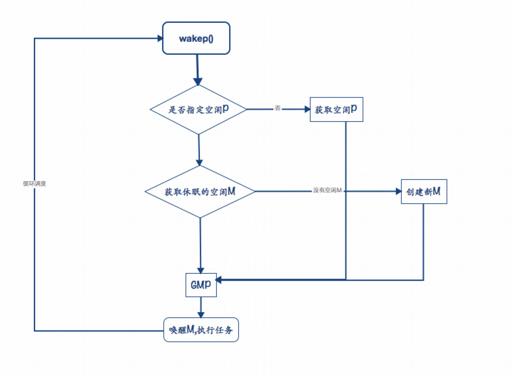

# Goroutine 源码解析

## Goroutine调用入口
```
$ go build -gcflags "-N -l -m" -o test main.go

$ go objdump -s "main\.main" test
TEXT main.main(SB) /Users/David/data/go/go.test/src/Demo/go_test/main.go
  main.go:11		0x1050b60		65488b0c2530000000	MOVQ GS:0x30, CX
  main.go:11		0x1050b69		483b6110		CMPQ 0x10(CX), SP
  main.go:11		0x1050b6d		763d			JBE 0x1050bac
  main.go:11		0x1050b6f		4883ec18		SUBQ $0x18, SP
  main.go:11		0x1050b73		48896c2410		MOVQ BP, 0x10(SP)
  main.go:11		0x1050b78		488d6c2410		LEAQ 0x10(SP), BP
  main.go:12		0x1050b7d		c7042400000000		MOVL $0x0, 0(SP)
  main.go:12		0x1050b84		488d0575280200		LEAQ go.func.*+77(SB), A
  main.go:12		0x1050b8b		4889442408		MOVQ AX, 0x8(SP)
  main.go:12		0x1050b90		e81bb0fdff		CALL runtime.newproc(SB)
  main.go:14		0x1050b95		48c7042400ca9a3b	MOVQ $0x3b9aca00, 0(SP)
  main.go:14		0x1050b9d		e86ebbfeff		CALL time.Sleep(SB)
  main.go:15		0x1050ba2		488b6c2410		MOVQ 0x10(SP), BP
  main.go:15		0x1050ba7		4883c418		ADDQ $0x18, SP
  main.go:15		0x1050bab		c3			RET
```


## Goroutine 调度执行


### GO 任务

#### 流程关系图


##### 源码剖析

```
// 创建新的goroutine运行函数fn.放入g等待队列,等待被调度
func newproc(siz int32, fn *funcval) {
    // 第一个参数地址
    argp := add(unsafe.Pointer(&fn), sys.PtrSize)

    // goroutine
    gp := getg()

    // 调用者pc寄存器
    // 现场恢复时使用
    pc := getcallerpc()

    systemstack(func() {
        newproc1(fn, (*uint8)(argp), siz, gp, pc)
    })
}

// 1. 创建g,然后将g任务放入p等待运行队列.
func newproc1(fn *funcval, argp *uint8, narg int32, callergp *g, callerpc uintptr) {
    _g_ := getg()

    // 参数大小+返回值
    siz := narg
    siz = (siz + 7) &^ 7

    // 从P本地队列获取G,如果本地队列为空,则批量从全局队列抢夺(Lock).
    // gFree队列内的G状态为_Gdead,未初始化状态.
    _p_ := _g_.m.p.ptr()
    newg := gfget(_p_)

    // 本地P队列、全局队列都为空,创建一个新的G
    if newg == nil {
        newg = malg(_StackMin)              // G最小默认2KB大小
        casgstatus(newg, _Gidle, _Gdead)    // G状态_Gdead(没有执行用户代码)
        allgadd(newg)                       // G放入allgs内(allgs 全局变量)
    }

	 // 计算所需内存空间大小(内存对齐)
    totalSize := 4*sys.RegSize + uintptr(siz) + sys.MinFrameSize 
    totalSize += -totalSize & (sys.SpAlign - 1)
    
    // 确定SP和参数入栈位置          
    sp := newg.stack.hi - totalSize
    spArg := sp

    // 将执行参数拷贝入栈
    memclrNoHeapPointers(unsafe.Pointer(&newg.sched), unsafe.Sizeof(newg.sched))

    // 将用户栈sp、pc、g放入当前G内部,用户现场保护
    newg.sched.sp = sp
    newg.stktopsp = sp
    newg.sched.pc = funcPC(goexit) + sys.PCQuantum
    newg.sched.g = guintptr(unsafe.Pointer(newg))
    gostartcallfn(&newg.sched, fn)                 // 现场保护,调用gosave

    // 初始化基本状态
    newg.gopc = callerpc                           // 调用者PC寄存器
    newg.ancestors = saveAncestors(callergp)       // callergp, 调用者G
    newg.startpc = fn.fn                           // 
    if _g_.m.curg != nil {                         // 当前G已经和M有绑定关系,打标签
        newg.labels = _g_.m.curg.labels
    }

    // G状态更改为_Grunnable
    casgstatus(newg, _Gdead, _Grunnable)
    
    
    if _p_.goidcache == _p_.goidcacheend {
    	// sched.goidgen是一个全局计数器
    	// 每次取回一段有效区间,然后在该区间分配,避免频繁地去全局操作。
		_p_.goidcache = atomic.Xadd64(&sched.goidgen, _GoidCacheBatch)
		_p_.goidcache -= _GoidCacheBatch - 1
		_p_.goidcacheend = _p_.goidcache + _GoidCacheBatch
	}
	newg.goid = int64(_p_.goidcache)
	_p_.goidcache++

    // G放到p队列
    // 1. 首先尝试放到_p_.runnext槽中(被调度优先级最高).
    // 2. 如果放入_p_.runnext失败,则将g添加到_p_本地队列尾部。
    // 3. 如果本地_p_队列满了,则将g放入全局队列。
    runqput(_p_, newg, true)
    
    // 如果有其它空闲P, 则尝试唤醒某个M起来执行任务
    // 如果有M, 处于自旋等待P 或 G状态, 放弃
    // 如果当前创建的事main goroutine(runtime.main),那么嗨没有其它任务需要执行, 放弃
    if atomic.Load(&sched.npidle) != 0 
    	&& atomic.Load(&sched.nmspinning) == 0 
    	&& mainStarted {
    	
    	// 尝试用wakep 唤醒M执行任务
		wakep()
	}
    return newg
}
```


## Go线程

### 唤醒M,执行任务流程图



### 源码剖析

```
func wakep() {
	// 被唤醒的线程需要绑定P,累加自旋计数,避免newproc1唤醒过多线程
	if !atomic.Cas(&sched.nmspinning, 0, 1) {
		return
	}
	startm(nil, true)
}

func startm(_p_ *p, spinning bool) {
	// 没有指定绑定P,尝试获取空闲P
	if _p_ == nil {
		// 获取空闲P
		_p_ = pidleget()

		// P获取失败,终止
		if _p_ == nil {
			// 递减自旋计数
			if spinning {
				if int32(atomic.Xadd(&sched.nmspinning, -1)) < 0 {
					throw("startm: negative nmspinning")
				}
			}
			return
		}
	}

	// 获取休眠的空闲M
	mp := mget()
	if mp == nil {
		// 如果没有空闲M,则创建一个新的M
		var fn func()
		if spinning {	
			fn = mspinning
		}
		newm(fn, _p_)
		return
	}

	// 设置自旋状态, 缓存P
	mp.spinning = spinning
	mp.nextp.set(_p_)

	// 唤醒M 
	notewakeup(&mp.park)
}


// 获取空闲P, Block
func pidleget() *p {
	_p_ := sched.pidle.ptr()
	if _p_ != nil {
		sched.pidle = _p_.link
		atomic.Xadd(&sched.npidle, -1)
	}
	return _p_
}

// 从M空闲队列获取M, Block
func mget() *m {
	mp := sched.midle.ptr()
	if mp != nil {
		sched.midle = mp.schedlink
		sched.nmidle--
	}
	return mp
}
```

#### 当M空闲列表为控制, 创建M

```
// M空闲列表没有M, 创建一个新M
func newm(fn func(), _p_ *p) {
	// 创建新M
	mp := allocm(_p_, fn)

	// 暂存P
	mp.nextp.set(_p_)
	
	if gp := getg(); gp != nil 
		&& gp.m != nil 
		&& (gp.m.lockedExt != 0 || gp.m.incgo) 
		&& GOOS != "plan9" {	
		
		// newmHandoff一个保存M结构体列表(这些M需要被调度到系统线程执行)
		mp.schedlink = newmHandoff.newm
		newmHandoff.newm.set(mp)      // 新创建M放入newm列表

		// 当M放入列表时,发送唤醒M信号
		if newmHandoff.waiting {
			newmHandoff.waiting = false

			// 唤醒M
			notewakeup(&newmHandoff.wake)
		}
		
		return
	}

	// 创建系统线程
	newm1(mp)
}

func allocm(_p_ *p, fn func()) *m {
	mp := new(m)       // 创建M
	mp.mstartfn = fn   // 启动函数
	mcommoninit(mp)    // 初始化

	// 创建G0
	if iscgo || GOOS == "solaris" || GOOS == "illumos" || GOOS == "windows" || GOOS == "plan9" || GOOS == "darwin" {
		mp.g0 = malg(-1)
	} else {
		mp.g0 = malg(8192 * sys.StackGuardMultiplier)
	}
	mp.g0.m = mp

	return mp
}
```

### Worker线程parking/unparking - 休眠/唤醒
我们需要保证worker线程数量跟CPU硬件并发性之间要取得平衡,以节省CPU资源和电源功耗。要实现以下两个原因并不简单:

* 调度程序状态按特定规则进行分布(根据process进行分配),而不是将所有调度程序全局分布。
* 为了获得最佳线程管理,需要知道未来优化方向(将来新的goroutine 就绪之后,工作线程不需要休眠)。

#### Go目前Worker线程调度做法

* 当G状态就绪,有空闲P,但没有处于自旋线程(M),则从M休眠队列唤醒一个M线程。
* 如果本地队列和全局队列任务都没有任务执行,则认为M线程正在自旋。自旋状态用m.spinning和sched.nmspinning表示。
* 当G没有发生切换,但Worker线程和G解绑,也会处于自旋状态。
* Worker线程休眠之前,自旋Worker线程会在每个P队列中寻找G任务。如果自旋线程找到G任务,它会将自己从自旋状态移出,继续执行G任务;如果找不到G任务,它会自动退出自旋状态,然后进入休眠状态。
* 当G状态就绪后,只要有一个自旋状态的Worker线程(sched.nmspinning > 1)存在,我们就不会唤醒一个新的Worker线程。为了弥补这一点,如果最后一个自旋线程拿到G任务,则当前Worker线程移出自旋状态。唤醒一个新的线程进入自旋状态。

这种调度做法,可以控制线程唤醒的数量,避免唤醒过多的Worker线程。也同时保证了最大CPU并行度的利用率。

#### Worker线程自旋状态转换
当Worker线程从Spinning -> non-spinning 转换期间要小心。自旋Worker线程状态转换可能会跟新创建G任务产生竞争,并且需要唤醒另外的Worker线程等情况。我们最终可能会出现CPU未充分利用。

* Goroutine就绪一般模式是: Goroutien写入P本地队列 -> StoreLoad-style内存屏障 -> 检查sched.nmspinning状态。

* Spinning -> non_spinning过渡一般模式是: nmspinning递减 -> StoreLoad-style内存屏障 -> 检查每个P队列的新任务。


注意: 以上的所有调度做法都是基于本地队列,不适用于全局运行队列。具体的全局队列调度查看nmspinning是如何操作的。


