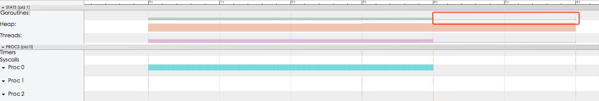

# Go Context
Context通俗理解和文章上下文相同概念。一篇文章,给你摘录一段,没前没后,你读不懂,因为没有语境,就是语言环境。一段话说了什么,要通过上下文来推断。

App点击一个按钮进入一个新的界面,也要保存你是在哪个屏幕跳转过来的等信息,以便你点击返回的时候正确跳回,如果不存在肯定无法正确跳回。   

### Context原理
Context是链式调用,通过WithCancel、WithDeadline、WithTimeout、withValue派生出新的Context。当Context被取消时,其派生的所有Context都将取消。

context.WithXXX返回新的Context和ContextFunc。调用CancelFunc将取消子代,移除父代对子代的引用,并且停止所有定时器。忘记调用CancelFunc将遗漏子代,直到父代被取消或定时器触发。

### UML图


### 实例
#### WithCancel

```
package main

import (
    "fmt"
    "time"
    "context"
    "runtime/trace"
)

func test() {
    ctx, cancel := context.WithCancel(context.Background())
    go func(ctx context.Context) {
        for {
            select {
            case <-ctx.Done():
                fmt.Println("监控退出,停止了...")
                return
            default:
                fmt.Println("goroutine监控中...")
                time.Sleep(2 * time.Second)
            }
        }
    }(ctx)

    time.Sleep(10 * time.Second)
    fmt.Println("可以了,通知停止监控")
    defer cancel()                    // 当执行完成后,不要忘记执行cancel()!!! 防止goroutine泄漏!!!

    time.Sleep(5 * time.Second)
}


func main() {
    f, err := os.Create("trace.out")
    if err != nil {
        log.Fatalf("failed to create trace output file: %v", err)
    }

    f, err = os.Create("trace.out")
    if err != nil {
        log.Fatalf("failed to create trace output file: %v", err)
    }

    trace.Start(f)
    defer trace.Stop()

    test()

    time.Sleep(2 * time.Second)
}
```

* trace数据分析


#### WithDeadline 实例
设置Deadline时间,当超过deadline,取消所有子Context。

```
func ExampleWithDeadline() {
    // 超时Deadline
    d := time.Now().Add(50 * time.Millisecond)

    // ctx  Context副本
    ctx, cancel := context.WithDeadline(context.Background(), d)

    // 取消Context所有子Context
    defer cancel()

    // 阻塞, 等待接收信号
    select {
    case <-time.After(1 * time.Second):
        fmt.Println("overslept")
    case <-ctx.Done():
        fmt.Println(ctx.Err())
    }

    // Output:
    // context deadline exceeded
}
```


#### WithTimeout 实例
WithTimeout是WithDeadline抽象。 WithTimeout() => WithDeadline(parent, time.Now().Add(timeout))

```
func ExampleWithTimeout() {
 ctx, cancel := context.WithTimeout(context.Background(), 50*time.Millisecond)
 defer cancel()

 select {
 case <-time.After(1 * time.Second):
     fmt.Println("overslept")
 case <-ctx.Done():
     fmt.Println(ctx.Err()) // prints "context deadline exceeded"
 }

 // Output:
 // context deadline exceeded
}
```

#### WithValue 实例
返回Parent副本,可以设置key/value。Context值仅允许请求范围的值传给进程或api接口.

```
func ExampleWithValue() {
 type favContextKey string

 f := func(ctx context.Context, k favContextKey) {
     if v := ctx.Value(k); v != nil {
         fmt.Println("found value:", v)
         return
     }
     fmt.Println("key not found:", k)
 }

 k := favContextKey("language")
 ctx := context.WithValue(context.Background(), k, "Go")

 f(ctx, k)
 f(ctx, favContextKey("color"))

 // Output:
 // found value: Go
 // key not found: color
}
```