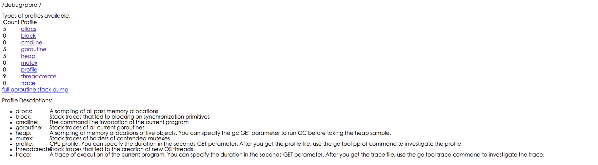
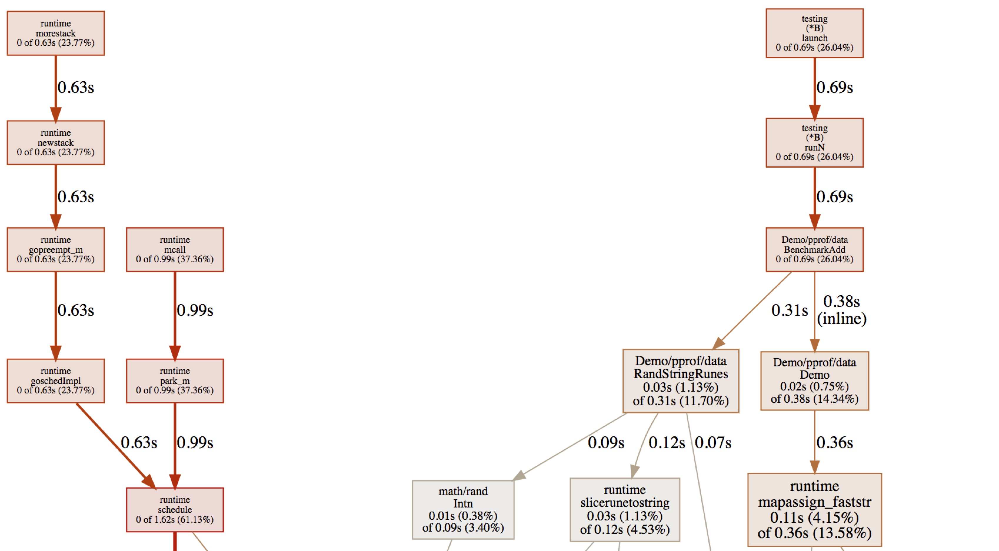
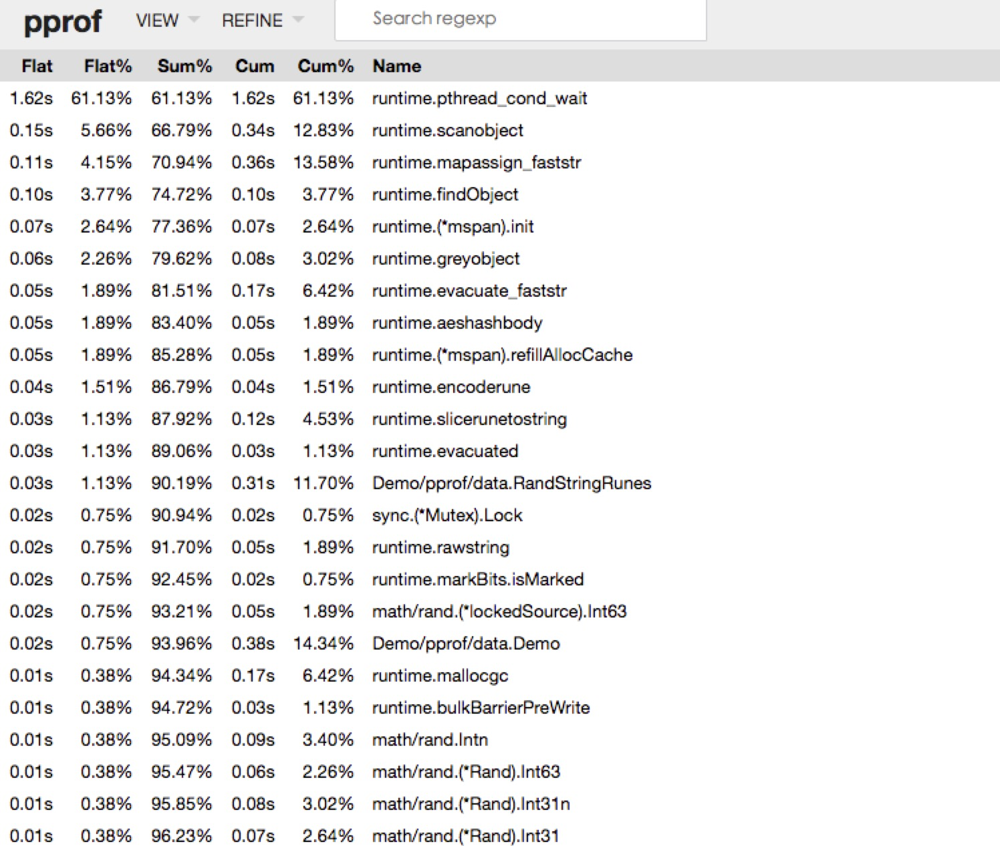
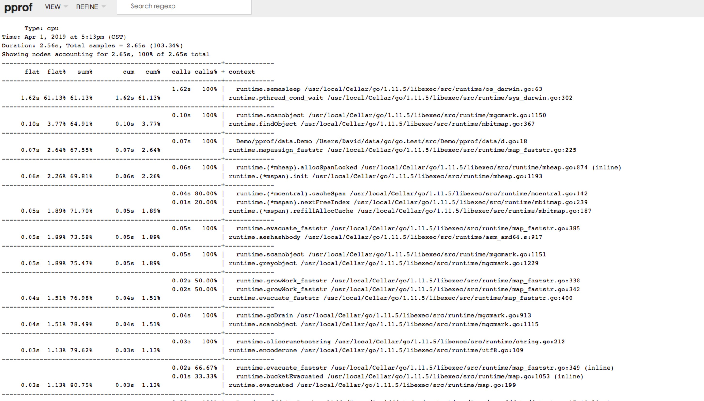
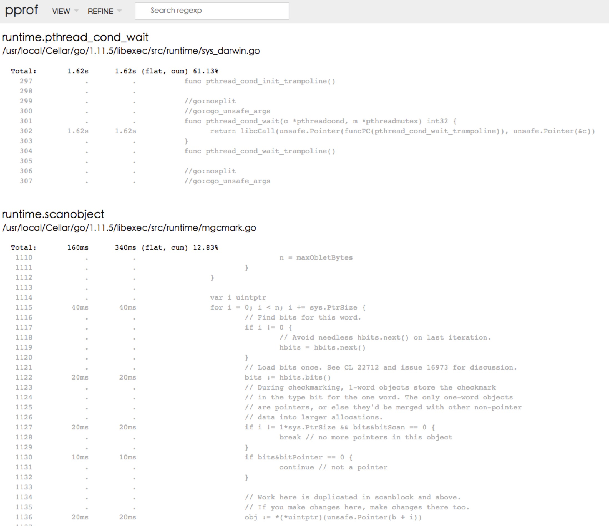

# pprof
pprof是用于可视化和分析性能分析数据的工具。

pprof以profile.proto格式读取分析样本的集合,并生成报告以可视化和帮助分析数据。它可以生成文本和图形报告。

Go标准库提供了两个pprof工具:

* runtime/pprof: 采集程序的运行数据进行分析。
* net/http/pprof: 采集HTTP Server的运行数据进行分析。

## 可以分析什么?
* CPU Profiling: CPU分析,按照一定频率采集所监听的应用程序CPU的使用情况,可确定应用程序消耗CPU周期时花费时间的位置。
* Memory Profiling: 内存分析,在应用程序进行heap分配时记录stack跟踪,用于监视当前和历史内存使用情况,以及检查内存泄漏。
* Block Profiling: 阻塞分析,记录Goroutine阻塞等待同步的位置。
* Mutex Profiling: 互斥锁分析,报告互斥锁的竞争情况。


### 实例

#### 代码实例

```
package data

import (
    "math/rand"
)

var letterRunes = []rune("abcdefghijklmnopqrstuvwxyzABCDEFGHIJKLMNOPQRSTUVWXYZ")

func RandStringRunes(n int) string {
    b := make([]rune, n)
    for i := range b {
        b[i] = letterRunes[rand.Intn(len(letterRunes))]
    }
    return string(b)
}

func Demo(data map[string]string, key string) {
    data[key] = key
}
```

#### 测试代码

```
package data

import (
    "testing"
)

func TestAdd(t *testing.T) {
    data := make(map[string]string)
    k := RandStringRunes(4)
    Demo(data, k)
}

func BenchmarkAdd(b *testing.B) {
    data := make(map[string]string)
    for i := 0; i < b.N; i++ {
        k := RandStringRunes(4)
        Demo(data, k)
    }
}
```


## 分析
可以通过以下几种方式对runtime 数据进行分析。

* 通过Web界面
* 通过交互式终端
* PProf可视化界面


### 通过Web界面
通过访问http://localhost:6060/debug/pprof查看分析结果。



可以通过分析描述备注信息查看每一子项具体的数据作用。比如:

* allocs: 内存分配采样数据。
* goroutine: 追踪当前的goroutine信息。
* heap: heap存活对象臭氧数据。
* 等等

### 通过交互式终端使用

```
$ go tool pprof http://localhost:6060/debug/pprof
Fetching profile over HTTP from http://localhost:6060/debug/pprof/heap
Saved profile in /Users/David/pprof/pprof.alloc_objects.alloc_space.inuse_objects.inuse_space.001.pb.gz
Type: inuse_space
Time: Apr 1, 2019 at 4:58pm (CST)
Entering interactive mode (type "help" for commands, "o" for options)
(pprof) top
Showing nodes accounting for 2086.86kB, 100% of 2086.86kB total
      flat  flat%   sum%        cum   cum%
 1184.27kB 56.75% 56.75%  1184.27kB 56.75%  runtime/pprof.StartCPUProfile
  902.59kB 43.25%   100%   902.59kB 43.25%  compress/flate.NewWriter
         0     0%   100%   902.59kB 43.25%  compress/gzip.(*Writer).Write
         0     0%   100%  1184.27kB 56.75%  net/http.(*ServeMux).ServeHTTP
         0     0%   100%  1184.27kB 56.75%  net/http.(*conn).serve
         0     0%   100%  1184.27kB 56.75%  net/http.HandlerFunc.ServeHTTP
         0     0%   100%  1184.27kB 56.75%  net/http.serverHandler.ServeHTTP
         0     0%   100%  1184.27kB 56.75%  net/http/pprof.Profile
         0     0%   100%   902.59kB 43.25%  runtime/pprof.(*profileBuilder).build
         0     0%   100%   902.59kB 43.25%  runtime/pprof.profileWriter
```

* flat: 给定函数上内存使用情况。
* flat%: 给定函数上内存使用占用总比例。
* Sum: 给定函数累积占用内存总比例。
* cum: 当前函数加上它之上的调用运行总占用内存。
* cum%： 所占百分比。

### PProf可视化界面

在分析pprof数据之前,首先需要生成分析数据:

```
$> go test -cpuprofile cpu.prof --memprofile mem.prof -bench .
```

对生成数据进行分析:

```
$> go tool pprof -http=:8080 cpu.prof
```

#### graph 


#### top


#### flamegraph


#### peek


#### source


通过Pprof可视化界面,可以更加直观看到Go 程序的调用链、资源使用情况等。在进行排查问题或分析故障时可以说是一把瑞士军刀。
