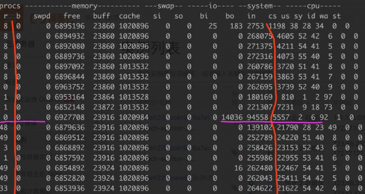

# Go gomaxprocs 不匹配引起 runtime 调度性能问题

## Golang Runtime

Golang的runtime调度是依赖PMG的角色抽象。`P` 为逻辑处理器，`M` 为执行体(线程)，`G` 为协程。`P` 的 `runq` 队列中放着可执行的`goroutine` 结构。Golang 默认p的数量为cpu core数目，比如物理核心为8 cpu core，那么go processor的数量就为8。另外，同一时间一个p只能绑定一个m线程，pm绑定后自然就找g和运行g。

&nbsp;

### Golang 在 Docker 环境下问题

在微服务体系下服务的部署通常是放在docker里的。一个宿主机里跑着大量的不同服务的容器，为了避免资源冲突，通常会合理的对每个容器做cpu资源控制。比如给一个golang服务的容器限定了2 cpu core的资源，容器内的服务不管怎么折腾，也确实只能用到大约2个cpu core的资源。

但golang初始化processor数量是依赖 `/proc/cpuinfo` 信息的，容器内的 `cpuinfo` 是跟宿主机一致的，这样导致容器只能用到2个cpu core，但golang初始化了跟物理cpu core相同数量的processor。

```bash


# 限制2核左右
root@hostanme:~# docker run -tid --cpu-period 100000 --cpu-quota 200000 ubuntu

# 容器内
root@a4f33fdd0240:/# cat /proc/cpuinfo| grep "processor"| wc -l
48

```

### runtime processor 多了会出现什么问题？

&nbsp;

一个runtime findrunnable时产生的损耗，另一个是线程引起的上下文切换。


runtime的 `findrunnable` 方法是解决m找可用的协程的函数，当从绑定p本地`runq` 上找不到可执行的goroutine后，尝试从全局链表中拿，再拿不到从netpoll和事件池里拿，最后会从别的p里偷任务。全局runq是有锁操作，其他偷任务使用了atomic原子操作来规避futex竞争下陷入切换等待问题，但lock free在竞争下也会有忙轮询的状态，比如不断的尝试。

```go
    // 全局 runq
    if sched.runqsize != 0 {
        lock(&sched.lock)
        gp := globrunqget(_p_, 0)
        unlock(&sched.lock)
        if gp != nil {
            return gp, false
        }
    }
// ...
    // 尝试4次从别的p偷任务
     for i := 0; i < 4; i++ {
        for enum := stealOrder.start(fastrand()); !enum.done(); enum.next() {
            if sched.gcwaiting != 0 {
                goto top
            }
            stealRunNextG := i > 2 // first look for ready queues with more than 1 g
            if gp := runqsteal(_p_, allp[enum.position()], stealRunNextG); gp != nil {
                return gp, false
            }
        }
    }
// ...
```

可通过 `godebug` 看到全局队列以及各个 `P` 的 `runq` 里等待调度的任务量。很多 P 是空的，会导致去其它队列偷任务，此时会产生锁。

随着调多runtime processor数量，相关的m线程自然也就跟着多了起来。linux内核为了保证可执行的线程在调度上雨露均沾，按照内核调度算法来切换就绪状态的线程，切换又引起上下文切换。上下文切换也是性能的一大杀手。`findrunnable` 的某些锁竞争也会触发上下文切换。

下面是我这边一个行情推送服务压测下的vmstat监控数据。首先把容器的的cpu core限制为8，再先后测试processor为8和48的情况。图的上面是processor为8的情况，下面为processor为48的情况。看图可以直观的发现当processor调大后，上下文切换明显多起来，另外等待调度的线程也多了。




### 解决docker下 Golang gomaxprocs校对问题

Uber的maxprocs库是一个Go语言库，用于优化Go程序的并发性能。它提供了一种自适应机制，可以根据系统的硬件资源动态调整Go程序的并发度，从而实现更好的性能。

通过使用maxprocs库，您可以实现Go程序的自适应并发性能优化，从而更好地利用系统的硬件资源，提高程序的性能和效率。

```go
import "github.com/uber-go/automaxprocs/maxprocs"


// maxprocs库会根据系统的硬件资源（例如CPU核心数量
// 自动计算出一个合适的并发度，并将GOMAXPROCS设置为该值。
func init() {
    maxprocs.Set(maxprocs.Logger(nil))
}
```
