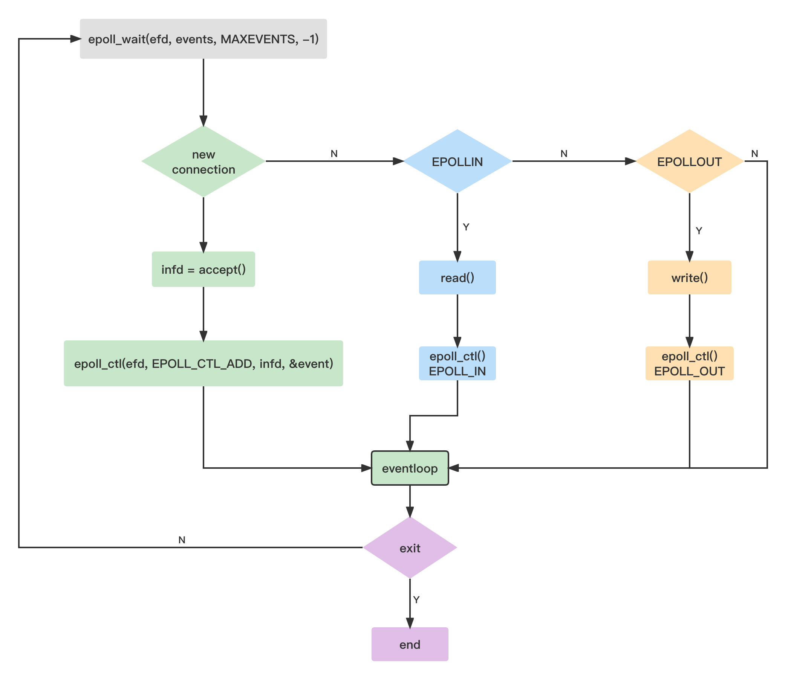

# 网络轮询

## netpoll流程图



&nbsp;

## Go netpoll

基于操作系统 `I/O` 多路复用机制，增强并发处理能力。

* I/O 模型:
    * 阻塞
    * 非阻塞
    * 多路复用

> 多路复用通常用循环处理多个I/O事件，常见的有 Linux/epoll、Darwin/kqueue、Windows/iocp、Solaris/evport等
>
> 多路复用函数阻塞监听一组文件描述符(fd)，当其中某些状态变为可读时，返回个数，获取事件关联描述符(ev.data)。

整体结构是包装系统调用(epoll)，然后在系统监控(sysmon)和调度器(scheduler)循环中轮询(netpoll)。通过发生事件源内的记录(rg、wg)获取目标goroutine，并唤醒。

不同于操作系统使用文件描述符，Go 轮询器使用更复杂的结构。

```go
// netpoll.go

// Network poller descriptor.
type pollDesc struct {
    
    link *pollDesc      // in pollcache, protected by pollcache.lock
    fd   uintptr        // constant for pollDesc usage lifetime
    
    rg   atomic.Uintptr // pdReady, pdWait, G waiting for read or nil
    wg   atomic.Uintptr // pdReady, pdWait, G waiting for write or nil

    closing bool
    
    rseq    uintptr     // protects from stale read timers
    rt      timer       // read deadline timer (set if rt.f != nil)
    rd      int64       // read deadline (a nanotime in the future, -1 when expired)
    
    wseq    uintptr     // protects from stale write timers
    wt      timer       // write deadline timer
    wd      int64       // write deadline (a nanotime in the future, -1 when expired)
}
```

该对象同样被复用。简单的链表结构，提供`alloc`、`free` 方法。

```go
type pollCache struct {
    lock  mutex
    first *pollDesc
}

var pollcache pollCache
```

&nbsp;

### 初始化

标准库内网络(net)、文件(file)、定时器(timer)等都依赖轮询器，会触发初始化操作。

* `src/net/fd_unix.go`：`net.netFD.init`
* `src/os/file_unix.go`：`os.newFile`
* `src/runtime/time.go`：`runtime.doaddtimer`

```go
// src/os/file_unix.go

func newFile(fd uintptr, name string, kind newFileKind) *File {
    
    f := &File{&file{
        pfd: poll.FD{}, ...
    }}

    if err := f.pfd.Init("file", pollable); err != nil {
    }
    
    ...
}
```

```go
// src/internal/poll/fd_unix.go

func (fd *FD) Init(net string, pollable bool) error {
    err := fd.pd.init(fd)
    return err
}
```

```go
// src/internal/poll/fd_poll_runtime.go

func (pd *pollDesc) init(fd *FD) error {
    serverInit.Do(runtime_pollServerInit)
    ctx, errno := runtime_pollOpen(uintptr(fd.Sysfd))
}
```

&nbsp;

初始化所调用函数由 `runtime` 实现。

```go
// netpoll.go

//go:linkname poll_runtime_pollServerInit internal/poll.runtime_pollServerInit
func poll_runtime_pollServerInit() {
    netpollGenericInit()
}
```

```go
var netpollInited uint32

func netpollGenericInit() {
    if atomic.Load(&netpollInited) == 0 {
        if netpollInited == 0 {
            netpollinit()
            atomic.Store(&netpollInited, 1)
        }
    }
}
```

&nbsp;

不同操作系统采用方案有所差异， 以Linux epoll为例。

```go
// netpoll_epoll.go

var (
    epfd int32 = -1                        // epoll descriptor
    netpollBreakRd, netpollBreakWr uintptr // for netpollBreak
)


func netpollinit() {
    
    // 创建 epoll，pipe 通信管道。
    epfd = epollcreate1(_EPOLL_CLOEXEC)
    r, w, errno := nonblockingPipe()
    
    // 将 pipe/r 添加到 epoll 。
    ev := epollevent{ events: _EPOLLIN }
    *(**uintptr)(unsafe.Pointer(&ev.data)) = &netpollBreakRd
    errno = epollctl(epfd, _EPOLL_CTL_ADD, r, &ev)
    
    netpollBreakRd = uintptr(r)
    netpollBreakWr = uintptr(w)
}
```

&nbsp;

事先添加了管道。因此，只要向管道写入数据，就可以引发事件，中断(interrupt)多路复用等操作。

```go
// netpollBreak interrupts an epollwait.
func netpollBreak() {
    if atomic.Cas(&netpollWakeSig, 0, 1) {
        for {
            var b byte
            n := write(netpollBreakWr, unsafe.Pointer(&b), 1)
            if n == 1 {
                break
            }
            if n == -_EINTR {
                continue
            }
            if n == -_EAGAIN {
                return
            }
            println("runtime: netpollBreak write failed with", -n)
            throw("runtime: netpollBreak write failed")
        }
    }
}
```

&nbsp;

### 增减事件

添加新监听事件。将`pollDesc`存入`epollevent.data`，作为事件源。

```go
// netpoll.go

//go:linkname poll_runtime_pollOpen internal/poll.runtime_pollOpen
func poll_runtime_pollOpen(fd uintptr) (*pollDesc, int) {

    pd := pollcache.alloc()
    wg := pd.wg.Load()
    
    pd.fd = fd
    pd.closing = false
    pd.setEventErr(false)
    pd.rseq++
    pd.rg.Store(0)
    pd.rd = 0
    pd.wseq++
    pd.wg.Store(0)
    pd.wd = 0
    pd.self = pd
    pd.publishInfo()

    errno := netpollopen(fd, pd)
    if errno != 0 {
        pollcache.free(pd)
        return nil, int(errno)
    }
    
    return pd, 0
}
```

```go
// netpoll_epoll.go

func netpollopen(fd uintptr, pd *pollDesc) int32 {
    
    var ev epollevent
    ev.events = _EPOLLIN | _EPOLLOUT | _EPOLLRDHUP | _EPOLLET // 可读、可写、挂起。
    *(**pollDesc)(unsafe.Pointer(&ev.data)) = pd              // 事件发生源。
    
    return -epollctl(epfd, _EPOLL_CTL_ADD, int32(fd), &ev)
}
```

&nbsp;

#### 删除事件

```go
// netpoll.go

//go:linkname poll_runtime_pollClose internal/poll.runtime_pollClose
func poll_runtime_pollClose(pd *pollDesc) {
    netpollclose(pd.fd)
    pollcache.free(pd)
}
```

```go
// netpoll_epoll.go

func netpollclose(fd uintptr) int32 {
    var ev epollevent
    return -epollctl(epfd, _EPOLL_CTL_DEL, int32(fd), &ev)
}
```

&nbsp;

#### 事件循环

在 `sysmon`、`schedule` 循环中轮询事件。

> 返回事件G列表，放回待运行队列。
>
> 另外，StartTheWorld 也会调用

```go
// proc.go

func sysmon() {
    for {
        usleep(delay)
    
        // poll network if not polled for more than 10ms
        lastpoll := int64(atomic.Load64(&sched.lastpoll))
        if netpollinited() && lastpoll != 0 && lastpoll+10*1000*1000 < now {

            // 修改最后轮询时间。
            atomic.Cas64(&sched.lastpoll, uint64(lastpoll), uint64(now))

            // 轮询，将结果（Gs）加入任务队列。
            list := netpoll(0) // non-blocking - returns list of goroutines

            if !list.empty() {
                injectglist(&list)
            }
        }
    }
}
```

```go
// proc.go

func findrunnable() (gp *g, inheritTime bool) {

    // Poll network.
    if netpollinited() && atomic.Load(&netpollWaiters) > 0 && atomic.Load64(&sched.lastpoll) != 0 {
        if list := netpoll(0); !list.empty() { // non-blocking

            // 拿出一个返回，其他放入任务队列。
            gp := list.pop()
            injectglist(&list)            
            casgstatus(gp, _Gwaiting, _Grunnable)

            return gp, false
        }
    }
}
```

&nbsp;

核心函数 `netpoll` 等待(epollwait) 事件发生，返回事件源 G列表。

```go
// netpoll_epoll.go

// netpoll checks for ready network connections.
// Returns list of goroutines that become runnable.
// delay < 0 : blocks indefinitely
// delay == 0: does not block, just polls
// delay > 0 : block for up to that many nanoseconds

func netpoll(delay int64) gList {
    
    if epfd == -1 {
        return gList{}
    }
    
    // 等待时间。
    var waitms int32
    if delay < 0 {
        waitms = -1
    } else if delay == 0 {
        waitms = 0
    } else if delay < 1e6 {
        waitms = 1
    } else if delay < 1e15 {
        waitms = int32(delay / 1e6)
    } else {
        // An arbitrary cap on how long to wait for a timer.
        // 1e9 ms == ~11.5 days.
        waitms = 1e9
    }
    
    var events [128]epollevent
retry:
    
    // 等待事件发生。
    n := epollwait(epfd, &events[0], int32(len(events)), waitms)
    
    if n < 0 {
        // If a timed sleep was interrupted, just return to
        // recalculate how long we should sleep now.
        if waitms > 0 {
            return gList{}
        }
        goto retry
    }
    
    var toRun gList
    
    // 处理发生的事件。
    for i := int32(0); i < n; i++ {

        ev := &events[i]
        if ev.events == 0 {
            continue
        }

        // 通过 ev.data 判断事件源头。
        if *(**uintptr)(unsafe.Pointer(&ev.data)) == &netpollBreakRd {

            // 中断。
            if delay != 0 {
                // netpollBreak could be picked up by a
                // nonblocking poll. Only read the byte
                // if blocking.
                var tmp [16]byte
                read(int32(netpollBreakRd), noescape(unsafe.Pointer(&tmp[0])), int32(len(tmp)))
                atomic.Store(&netpollWakeSig, 0)
            }
            continue
        }

        // 返回事件源 G 列表。
        var mode int32
        if ev.events&(_EPOLLIN|_EPOLLRDHUP|_EPOLLHUP|_EPOLLERR) != 0 {
            mode += 'r'
        }

        if ev.events&(_EPOLLOUT|_EPOLLHUP|_EPOLLERR) != 0 {
            mode += 'w'
        }
    
        if mode != 0 {
            pd := *(**pollDesc)(unsafe.Pointer(&ev.data))
            pd.setEventErr(ev.events == _EPOLLERR)
            netpollready(&toRun, pd, mode)
        }
    }
    
    return toRun
}
```

```go
// netpoll.go

// netpollready is called by the platform-specific netpoll function.
// It declares that the fd associated with pd is ready for I/O.
// The toRun argument is used to build a list of goroutines to return
// from netpoll. The mode argument is 'r', 'w', or 'r'+'w' to indicate
// whether the fd is ready for reading or writing or both.

func netpollready(toRun *gList, pd *pollDesc, mode int32) {
    var rg, wg *g
    
    if mode == 'r' || mode == 'r'+'w' { rg = netpollunblock(pd, 'r', true) }
    if mode == 'w' || mode == 'r'+'w' { wg = netpollunblock(pd, 'w', true) }
    
    // 读写分别处理，两个事件。
    if rg != nil { toRun.push(rg) }
    if wg != nil { toRun.push(wg) }
}
```

```go
// netpoll.go

// pollDesc contains 2 binary semaphores, rg and wg, to park reader and writer
// goroutines respectively. The semaphore can be in the following states:
//
// pdReady   - io readiness notification is pending;
//             a goroutine consumes the notification by changing the state to nil.
// pdWait    - a goroutine prepares to park on the semaphore, but not yet parked;
//             the goroutine commits to park by changing the state to G pointer,
//             or, alternatively, concurrent io notification changes the state to pdReady,
//             or, alternatively, concurrent timeout/close changes the state to nil.
// G pointer - the goroutine is blocked on the semaphore;
//             io notification or timeout/close changes the state to pdReady or nil respectively
//             and unparks the goroutine.
// nil       - none of the above.

const (
    pdReady uintptr = 1
    pdWait  uintptr = 2
)

func netpollunblock(pd *pollDesc, mode int32, ioready bool) *g {
    
    // 信号指针。
    gpp := &pd.rg
    if mode == 'w' {
        gpp = &pd.wg
    }

    for {
        old := gpp.Load()
        if old == pdReady { return nil }
        if old == 0 && !ioready { return nil }

        // 返回 G。
        var new uintptr
        if ioready { new = pdReady }

        if gpp.CompareAndSwap(old, new) {
            if old == pdWait { old = 0 }
            return (*g)(unsafe.Pointer(old))
        }
    }
}
```

&nbsp;

### 超时设置

I/O 过期时间(deadline)也由轮询器处理。

> `rt`、`wt`：读、写计时器。
>
> `rd`、`wd`：读、写截止时间。

```go
// netpoll.go

//go:linkname poll_runtime_pollSetDeadline internal/poll.runtime_pollSetDeadline
func poll_runtime_pollSetDeadline(pd *pollDesc, d int64, mode int) {
    
    // 旧截止时间。
    rd0, wd0 := pd.rd, pd.wd
    combo0 := rd0 > 0 && rd0 == wd0  // 过期时间相同，组合方式。
    
    if d > 0 { d += nanotime() }
    if mode == 'r' || mode == 'r'+'w' { pd.rd = d }
    if mode == 'w' || mode == 'r'+'w' { pd.wd = d }
    
    pd.publishInfo()
    
    // 定时器函数。
    combo := pd.rd > 0 && pd.rd == pd.wd
    rtf := netpollReadDeadline              // 读过期
    if combo { rtf = netpollDeadline }      // 组合过期
    
    // 设置定时器。
    if pd.rt.f == nil {
        if pd.rd > 0 {
            // 设置定时器函数，重置。
            pd.rt.f = rtf
            resettimer(&pd.rt, pd.rd)
        }
    } else if pd.rd != rd0 || combo != combo0 {
        // 修改设置或删除。
        if pd.rd > 0 {
            modtimer(&pd.rt, pd.rd, 0, rtf, pd.makeArg(), pd.rseq)
        } else {
            deltimer(&pd.rt)
            pd.rt.f = nil
        }
    }

       ...
    
    // 如果截止时间 <0，直接唤醒目标 G。
    var rg, wg *g
    if pd.rd < 0 { rg = netpollunblock(pd, 'r', false) }
    if pd.wd < 0 { wg = netpollunblock(pd, 'w', false) }

    if rg != nil { netpollgoready(rg, 3) }
    if wg != nil { netpollgoready(wg, 3) }
}
```

```go
func netpollgoready(gp *g, traceskip int) {
    atomic.Xadd(&netpollWaiters, -1)
    goready(gp, traceskip+1)
}
```
