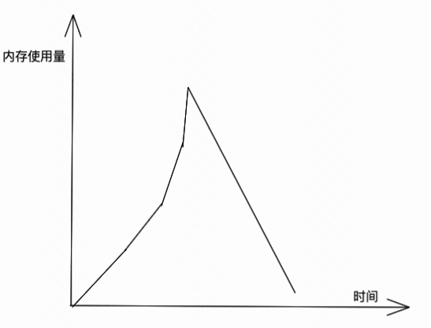
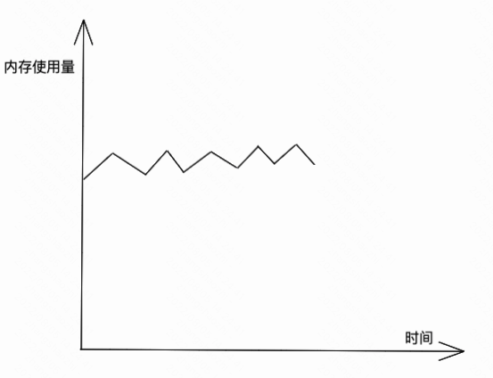
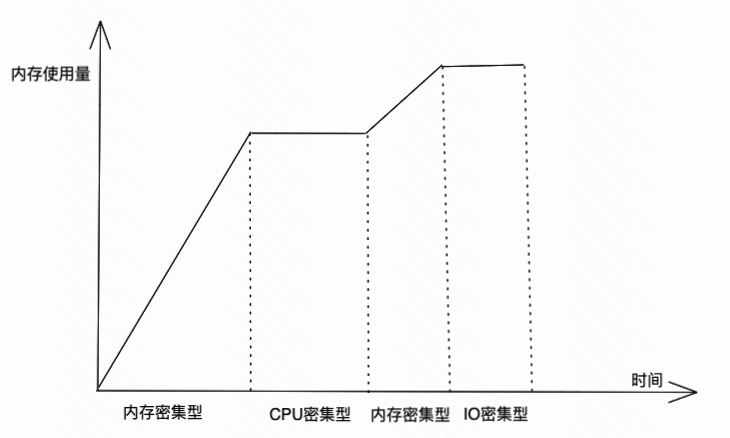
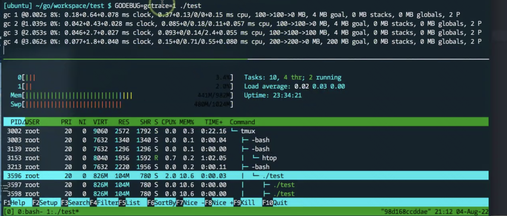
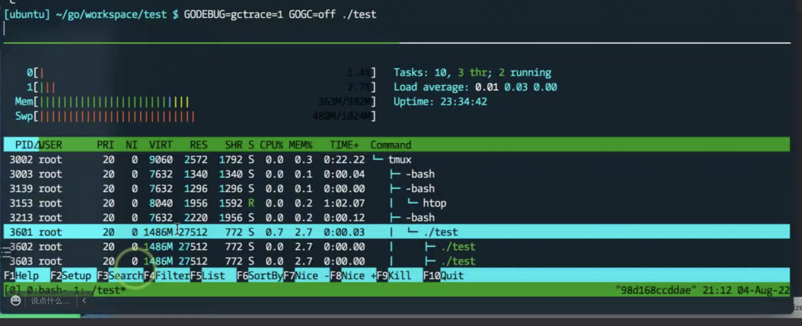
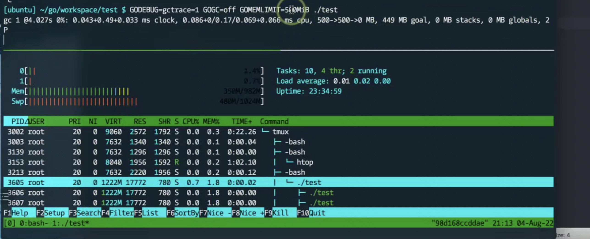
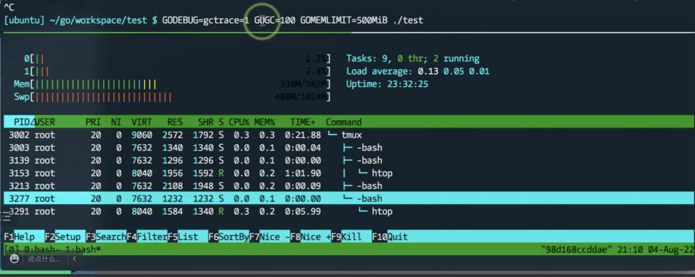

# memory_limit

1.19 版本`GOGC`参数增加了`memory_limit`选项。通过该选项控制Go使用内存总量及调整Go GC垃圾回收器的行为。

该选项有两种形式:

* 通过 `runtime/debug`函数调用 `SetMemoryLimit`。
* 使用 `GOMEMLIMIT` 环境变量。

&nbsp;

## 使用场景

* APP在某一段时期内存使用达到峰值，然后开始下降，内存使用未达到下次的**GC goal**。所以，在sysmon启动期间未启动GC，该堆内存无法回收。在此期间，如果内存耗尽会触发OOM。如果设置`memory_limit`，当达到该阈值，则触发GC。



* APP如果内存持续增长，但是无需频发触发GC，则可以通过设置`memory_limit`控制GC触发次数。



* 如果APP存在内存密集型、IO密集型、CPU密集型等混合应用。则可以在内存密集段，设置`memory_limit`控制GC触发次数。



&nbsp;

## 1.19版本之前GC管理

在1.19版本`memory_limit`之前，可使用**Go GC**和**Go Ballast**方式控制GC触发时间。

&nbsp;

## Go GC

可通过调整GC的步调，以调整GC的触发频率。

* 设置 `GOGC`
* 设置 `debug.SetGCPercent()`

这两种方式的原理和效果都是一样的，`GOGC` 默认值是100，也就是下次GC触发的heap的大小是这次GC之后的heap的一倍。

我们都知道GO的GC是标记-清除方式，当GC会触发时全量遍历变量进行标记，当标记结束后执行清除，把标记为白色的对象执行垃圾回收。值得注意的是，这里的回收仅仅是标记内存可以返回给操作系统，并不是立即回收，这就是你看到Go应用RSS一直居高不下的原因。在整个垃圾回收过程中会暂停整个Go程序（STW），Go垃圾回收的耗时还是主要取决于标记花费的时间的长短，清除过程是非常快的。

&nbsp;

### Go GC 和 memory_limit 组合使用

* 使用垃圾回收器



&nbsp;

* 关闭GC



&nbsp;

* 500M内存启动GC



* 500M内存兜底



&nbsp;

## Go Ballast

在1.19版本之前，可使用**Go Ballact**方法替代。**Go ballast**就是初始化一个生命周期贯穿整个 Go 应用生命周期的超大`slice`。

```go
//nolint:gomnd
package main

import (
 "runtime"

 "git.hualala.com/ocean/logging/cmd/execute"
)

func main() {
 // tidb gc optimize pr: https://github.com/pingcap/tidb/pull/29121
 var ballast = make([]byte, 6*1024*1024*1024) // 6G
 defer runtime.KeepAlive(ballast)

 execute.Start(execute.BrokerRole)
}
```

上面的代码就初始化了一个**ballast**，利用`runtime.KeepAlive`来保证**ballast**不会被GC给回收掉。

利用这个特性，就能保证GC在10G的一倍时才能被触发，这样就能够比较精准控制GO GC的触发时机。

&nbsp;

参考:

* [go issue 48409](https://github.com/golang/go/issues/48409)
* [go issue 23044](https://github.com/golang/go/issues/23044)
* [tidb ballast](https://github.com/pingcap/tidb/pull/29121/files)
* [cortex ballast](https://github.com/cortexproject/cortex/blob/master/cmd/cortex/main.go#L148)
* [48409-soft-memory-limit](https://github.com/golang/proposal/blob/master/design/48409-soft-memory-limit.md)
* [https://mp.weixin.qq.com/s/gc34RYqmzeMndEJ1-7sOwg](https://mp.weixin.qq.com/s/gc34RYqmzeMndEJ1-7sOwg)
* [https://blog.twitch.tv/en/2019/04/10/go-memory-ballast-how-i-learnt-to-stop-worrying-and-love-the-heap/](https://blog.twitch.tv/en/2019/04/10/go-memory-ballast-how-i-learnt-to-stop-worrying-and-love-the-heap/)
